# AT_TEST_PAGE Adobe Target 연동 가이드

이 문서는 본 저장소에 **실제로 적용된** Adobe Target 연동을, 처음 보는 사람도 위에서 아래로 읽으면 이해되도록 정리한 것이다.

이 프로젝트에는 Target을 부르는 길이 **두 가지**다.

- **웹(서버 프록시) 길** — 브라우저는 Adobe를 직접 부르지 않고, 우리 **FastAPI 백엔드**가 Adobe **Target Python SDK**로 대신 호출한다.
- **네이티브(모바일 SDK) 길** — Android/iOS 앱은 **Adobe Mobile SDK**를 앱에 심어 Adobe를 **직접** 호출한다.

> 일반 FastAPI 앱 설정·쿠폰 CRUD·PostgreSQL 스키마는 이 문서의 범위가 아니다.

### 연관 문서 (`docs/main`)

1. `01_AT_TEST_PAGE_PRD.md` — 제품 범위·수용 기준
2. `02_AT_TEST_PAGE_FRONTEND_GUIDE.md` — 앱 라우트·컴포넌트(쿠폰 등)
3. `03_AT_TEST_PAGE_BACKEND_GUIDE.md` — 쿠폰 API·실행 방법

### 이 문서를 읽는 순서

```text
1부. 개념        — Target이 뭔지, 용어 5개, 두 길의 차이
2부. 웹 길        — 흐름 → 식별 정책 → 백엔드 알고리즘 → 프론트 → HTTP 예시
3부. 네이티브 길  — 흐름 → 왜 분리하나 → 패키지/설정 → 코드 → 테스트 화면 → 추천(Recommendations) → 빌드
4부. 운영        — 설정 총정리 → 체크리스트 → 문제 해결 → **부록 A~C(JSON 오퍼·하이브리드)** → 이력
```

---

# 1부. 먼저 알아야 할 개념

## 1. Adobe Target 핵심 용어 5개

| 용어 | 한 줄 설명 | 비유 |
|------|------------|------|
| **mbox** | 콘텐츠를 받아올 "위치 이름". 요청할 때 이 이름으로 무엇을 받을지 지정한다. | TV의 "채널 번호" |
| **offer(오퍼)** | mbox로 돌아오는 실제 콘텐츠(텍스트·JSON 등). | 그 채널에서 나오는 "방송 내용" |
| **Activity(액티비티)** | "이 mbox에는 이런 조건일 때 이 오퍼를 줘라"라는 Adobe 쪽 규칙. | 편성표 |
| **Audience / Profile** | 방문자를 분류하는 조건(나이·등급 등)과 그 방문자에 대해 Adobe가 저장하는 속성. | 시청자 등급·취향 메모 |
| **방문자 ID** | 같은 사람을 계속 알아보기 위한 식별자. `tntId`, `thirdPartyId` 두 종류를 쓴다(§5). | 회원증 번호 |

> 핵심 한 줄: **"mbox 이름으로 요청 → Adobe가 Activity 규칙을 평가 → 오퍼를 응답"**. 우리 코드는 이 요청/응답을 웹은 백엔드가, 네이티브는 앱이 직접 수행한다.

## 2. 두 가지 연동 방식 비교

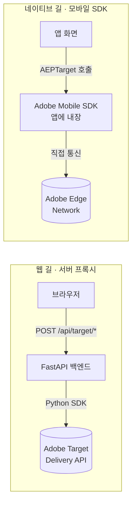

| 구분 | 웹(서버 프록시) | 네이티브(모바일 SDK) |
|------|------------------|----------------------|
| Adobe를 누가 부르나 | **FastAPI 백엔드** | **앱 자신** |
| 사용 SDK | `target-python-sdk`(서버) | `@adobe/react-native-aep*`(앱) |
| 설정값 출처 | `backend/env/config.adobe.json` | Data Collection **Tags 속성**의 Environment File ID(`appId`) |
| 브라우저/앱이 Adobe와 직접 통신? | ❌ 안 함(백엔드가 대신) | ✅ 함 |
| 적용 플랫폼 | 웹 | Android / iOS |
| 코드 위치 | `backend/adobe_backend/target_backend/` + `frontend/adobe_frontend/.../utils/*` | `frontend/adobe_frontend/.../native/*` |

> 두 길은 **서로 독립**이다. 네이티브 SDK를 추가해도 웹 동작은 전혀 바뀌지 않는다(분리 방법은 §13).

---

# 2부. 웹(서버 프록시) 연동

## 3. 웹 연동 전체 흐름

브라우저에는 Adobe JS SDK가 없다. 모든 Target 호출은 백엔드를 거친다.

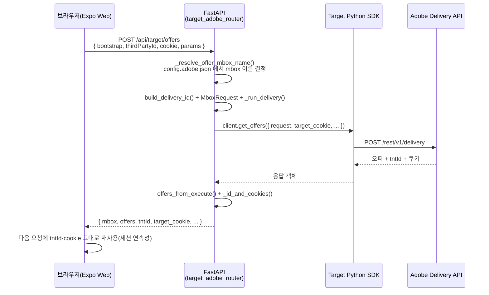

세 가지 화면(엔드포인트)이 같은 패턴을 공유한다.

| 화면 | 엔드포인트 | 목적 |
|------|------------|------|
| 메인/갤러리 | `POST /api/target/offers` | mbox 오퍼 받아 UI에 반영 |
| 프로필 테스트 | `POST /api/target/profile-test` | 프로필 속성 저장·스크립트 검증 |
| 추천 테스트 | `POST /api/target/recommendation-test` | Recommendations 오퍼 검증 |

## 4. 방문자 식별 정책 (가장 중요한 규칙)

Adobe가 "같은 사람"으로 인식하게 하려면 매 요청에 식별자를 **일관되게** 실어 보내고, 응답으로 받은 값을 **다음 요청에 되돌려** 보내야 한다.

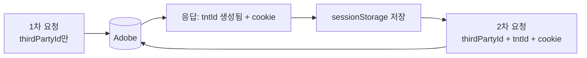

| 식별자/값 | 누가 만드나 | 순환 방식 |
|-----------|-------------|-----------|
| **`tntId`** | 비어 있으면 **Adobe가 생성** | 응답의 `tntId`를 다음 요청에 그대로 실어 세션 연속성 유지 |
| **`thirdPartyId`** | 웹이 UUID를 1회 만들어 `sessionStorage`에 고정(offers·profile) | 매 요청 동일 값 전송. 추천 테스트는 UI의 **`recipient_id`**를 사용하고, 비면 서버가 UUID 생성 |
| **`customerIds`** | 추천 테스트에서 `recipient_id`가 있을 때만 | Delivery `id`에 `integration_code="recipient_id"`로 부착 |
| **`target_cookie`** | Adobe 응답 | 응답 쿠키 dict의 **`value` 문자열**만 다음 요청 옵션으로 재전달 |
| **`target_location_hint`** | Adobe 응답(`..._cookie`) | 엣지 라우팅 힌트. `value`만 재전달 |
| **`session_id`** | 호출자 | offers·profile만 사용. **추천 테스트는 `None`** 고정 |

> 용어 함정: 요청 옵션 이름은 `target_location_hint`인데, **응답** 쿠키 키 이름은 `target_location_hint_cookie`다(둘은 다르다, §7).

## 5. 백엔드 구조와 알고리즘

**위치:** `backend/adobe_backend/target_backend/` · **마운트:** `target_main.register_target_routes(app)` → `prefix=/api`

```text
target_main.py            register_target_routes(app)  ← app/main.py에서만 호출
target_adobe_router.py    엔드포인트 3개 + 공통 헬퍼   ← 핵심
target_config.py          config.adobe.json 로드(캐시)
target_client.py          TargetClient 싱글톤
target_delivery_utils.py  VisitorId 조립·오퍼 파싱
target_debug_utils.py     AT_DEBUG_DELIVERY=1 진단 로그
```

### 5.1 설정 로드 — `target_config.py`

1. `backend/env/config.adobe.json`의 `administration`·`mboxes` 블록을 읽어 `AdobeTargetSettings`(불변 dataclass)로 반환한다.
2. `client`·`organization_id`·`property_token`은 **필수 + ASCII**여야 한다. 비었거나 한글 등이면 `AdobeTargetConfigError` → 엔드포인트에서 **HTTP 400**.
3. mbox 기본값: `offer_mbox_name`(없으면 `target-global-mbox`), `recs_mbox_name`(`target-recs-mbox`), `bootstrap_mbox_name`(`target-ready-mbox`).
4. `@lru_cache`로 1회만 로드(싱글톤). 설정을 바꾸면 캐시를 비워야 반영된다(`clear_caches()`).

### 5.2 클라이언트 싱글톤 — `target_client.py`

- `TargetClient.create({client, organization_id, timeout})`를 `@lru_cache`로 1개만 생성한다.
- `property_token`은 요청 조립 시 `ModelProperty(token=...)`로 들어간다.

### 5.3 공통 요청 조립 (세 엔드포인트 공유)

```text
build_delivery_id(tnt_id, third_party_id, customer_ids?)  → VisitorId
        │  셋 다 비면 빈 VisitorId() → Adobe가 tntId 자동 생성
        ▼
_run_delivery(label, id, mbox, cookie, hint, session)  ← 3개 엔드포인트 공통
  DeliveryRequest(
    id      = VisitorId,
    context = Context(channel=WEB),
    execute = ExecuteRequest(mboxes=[ MboxRequest(...) ]),
    _property = ModelProperty(token=property_token)
  )
        ▼
  client.get_offers({ "request": request, **sdk_opts })
        │  sdk_opts = 값이 있는 것만: target_cookie / target_location_hint / (offers·profile만)session_id
        ▼
응답 가공:  offers_from_execute()  +  _id_and_cookies()
```

> **블로킹 방지:** Python SDK는 동기 함수다. 엔드포인트는 `await asyncio.to_thread(...)`로 별도 스레드에서 호출해 이벤트 루프를 막지 않는다.

### 5.4 엔드포인트 ①  `POST /api/target/offers`

- **목적:** mbox 오퍼를 받아 UI(메인 캐러셀·갤러리·이벤트 팝업)에 반영.
- **요청 본문(`OffersRequest`):**

```jsonc
{
  "bootstrap": true,                   // true→bootstrap_mbox_name, false/생략→offer_mbox_name (서버가 config.adobe.json 으로 결정)
  "mbox_name": "",                     // (선택) 직접 지정 시 우선. 웹은 보내지 않음 — 백엔드 단일 소스 사용
  "thirdPartyId": "3f2a…uuid",        // tntId / tnt_id 도 허용(camelCase·snake 둘 다 수신)
  "tntId": "",
  "target_cookie": "",                 // 직전 응답의 value 문자열
  "target_location_hint": "",
  "session_id": "",
  "params": { "page": "main" }         // → mbox parameters (Audience 조건 등)
}
```

> **mbox 이름 단일 소스:** 웹 프론트는 mbox 이름을 하드코딩하지 않는다. `bootstrap` 역할만 보내면 백엔드 `_resolve_offer_mbox_name()`이 `config.adobe.json`(`bootstrap_mbox_name`/`offer_mbox_name`)에서 실제 이름을 결정한다. 이름을 바꿀 때 백엔드 설정 한 곳만 수정하면 된다.

- **알고리즘:** `_resolve_offer_mbox_name` → `build_delivery_id` → `MboxRequest(name, index=0, parameters=params)` → `_run_delivery`(DeliveryRequest 조립+로깅+`get_offers`) → `offers_from_execute(resp)`.
- ⚠️ `page_url`은 **본문으로 받기만** 하고 `DeliveryRequest`/`Context`에는 연결하지 않는다.
- **응답:** `mbox`, `offers`(문자열 content 그대로일 수 있음), `tntId`, `target_cookie`(dict) 등.

### 5.5 엔드포인트 ②  `POST /api/target/profile-test`

- **목적:** 프로필 속성 저장·Profile Script·Audience 평가를 offers와 **같은 mbox 컨텍스트**에서 검증.
- **요청 본문(`ProfileTestRequest`):** offers와 동일한 방문자 필드(공통 베이스 `_TargetVisitorRequest` 상속)인데 `params` 대신 **`profile_params`**(dict). mbox 기본값은 `offer_mbox_name`(설정 단일 소스).
- **핵심 차이:** `MboxRequest`에 `parameters`가 아니라 **`profile_parameters`** 슬롯으로 싣는다 → 값이 Adobe **프로필에 저장**된다.
- **응답:** `mbox`, `status`, `request_id`, `offers`(이때는 `parse_json=True`로 JSON 파싱), **`response_tokens`** 요약, id·쿠키.

### 5.6 엔드포인트 ③  `POST /api/target/recommendation-test`

가장 복잡하다. 단계별로:

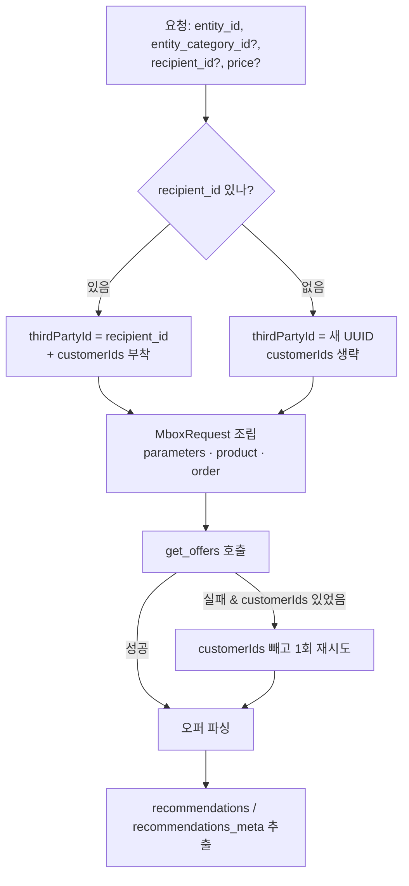

1. **mbox 이름** = `settings.recs_mbox_name`(Adobe Recommendations Activity Location과 동일해야 함).
2. **식별자:** `recipient_id`가 있으면 그 값을 `thirdPartyId`로 쓰고 `customerIds=[CustomerId(id, integration_code="recipient_id", AUTHENTICATED)]` 부착. 없으면 `thirdPartyId`만 새 UUID.
3. **카테고리 정규화:** `entity_category_id`가 비었거나 **`ss`(매장)** 이면 `categoryId`는 **빈 문자열**.
4. **MboxRequest:**
   - `parameters`: `{ "entity.id": …, "entity.categoryId": … }` (항상 키 존재, 값은 위 규칙)
   - `product`: `Product(id=entity_id, category_id=cat)`
   - `order`: `Order(id="ord_"+12hex, total=price(기본 1000), purchased_product_ids=[entity_id])`
5. **재시도:** `customerIds` 경로로 실패하면 로그 후 **`customerIds` 없이** 한 번 더 시도.
6. **오퍼 → 추천 변환:** 오퍼 `content`가 `dict`면 `content.meta`→`recommendations_meta`, `content.items`→`recommendations`. `list`면 그대로 펼침.
7. ⚠️ `session_id`는 사용하지 않는다(옵션에 `None`).
8. **응답:** `mbox`, `status`, `request_id`, `offers`, `recommendations`, `recommendations_meta`, `response_tokens`(빈 배열), `tntId`, `thirdPartyId`, `target_cookie`, `target_location_hint_cookie`.

### 5.7 응답 파싱 — `offers_from_execute()`

- `execute.page_load.options`와 모든 `execute.mboxes[].options`를 **전부** 스캔해 `{source, type, content, mbox_name?, response_tokens?}` 목록으로 만든다.
- `parse_json=True`면 문자열 `content`를 `json.loads`로 dict 변환 시도(실패하면 원본 유지).

### 5.8 예외 처리 · 디버그

| 상황 | 처리(`_handle_error`) |
|------|------------------------|
| 설정 오류(`AdobeTargetConfigError`) | **HTTP 400** + 메시지 |
| URL 파싱 오류(`LocationParseError`) | 캐시 비우고 **HTTP 400** |
| Adobe `ApiException` status 400 | **HTTP 400** + 원문 body |
| 그 외 Adobe 오류 | **HTTP 502** + `{code:"adobe_target_unavailable", …}` |

- **진단 로그:** 환경변수 `AT_DEBUG_DELIVERY=1`일 때만 요청 요약·`to_str`·응답 `to_dict`를 청크로 출력(`target_debug_utils.py`). 평소엔 끈다.

## 6. 프론트엔드(웹) 구조

### 6.1 경로 매핑·브리지

- Target UI·fetch·Context는 `frontend/adobe_frontend/target_frontend/`에 둔다.
- `frontend/tsconfig.json`의 `paths`로 **`@adobe/*`** → 위 폴더. 예: `@adobe/app/targetApp`, `@adobe/components/ProfileTestPanel`.
- 앱 루트의 기존 경로(`@/components/ImageCarousel` 등)를 유지하려고 **브리지 파일**만 둔다.

| 브리지(`frontend/…`) | 실제 구현 |
|----------------------|-----------|
| `components/ImageCarousel.tsx` | `adobe_frontend/.../targetImageCarousel.tsx` |
| `components/EventPopup.tsx` | `adobe_frontend/.../EventPopup.tsx` |
| `context/AdobeTargetContext.tsx` | `adobe_frontend/.../context/targetContext.tsx` |
| `context/VisitorContext.tsx` | `adobe_frontend/.../context/visitorContext.tsx` |

### 6.2 주요 파일과 책임

| 경로 | 역할 |
|------|------|
| `app/_layout.tsx` | `TargetAppProvider` + `VisitorProvider` + `TargetPageBootstrap` + `AppHeader` + **TopBanner/BottomBanner** + `Stack` + `AppFooter` |
| `app/main.tsx` | Context 소비, `EventPopup` |
| `components/login/*` | 회선 로그인 모달·`GET /api/telecom/lines` |
| `adobe_frontend/.../app/TargetPageBootstrap.tsx` | **웹**: bootstrap+배너 mbox `POST /api/target/offers` / **네이티브**: `banner_sdk_mbox_names` SDK 일괄 조회 |
| `adobe_frontend/.../context/targetContext.tsx` | 오퍼·배너·`bannersReady`, `refreshOffers()` |
| `adobe_frontend/.../context/visitorContext.tsx` | 회선 로그인 → `thirdPartyId` 주입·로그아웃 시 reset |
| `adobe_frontend/.../utils/targetOffersFetch.ts` | `POST /api/target/offers`(역할 offer/bootstrap별 dedupe) |
| `adobe_frontend/.../utils/targetProfileTest.ts` | `POST /api/target/profile-test` |
| `adobe_frontend/.../utils/targetRecommendationTest.ts` | `POST /api/target/recommendation-test` |
| `adobe_frontend/.../utils/targetHttp.ts` | **3개 fetch 공통 헬퍼**: API URL·쿠키 추출·세션 읽기·응답→세션 저장 |
| `adobe_frontend/.../utils/targetSession.ts` | 세션 키(`AT_*` 공통, `AT_RECS_*` 추천 전용) |
| `adobe_frontend/.../utils/sessionStore.ts` | **웹/네이티브 범용 저장소**(§12) |
| `adobe_frontend/.../utils/targetOfferParser.ts` | JSON 오퍼 파싱(`event-popup`·`top-banner`·`bottom-banner`·캐러셀) — **부록 C** |

> JSON 오퍼 샘플·mbox 매트릭스: **부록 C**. 회선 로그인: **§6.3**.

### 6.3 회선 로그인(방문자 식별자 주입)

데모용 **회선 선택 로그인**으로 Target Audience를 검증한다(운영 인증 아님).

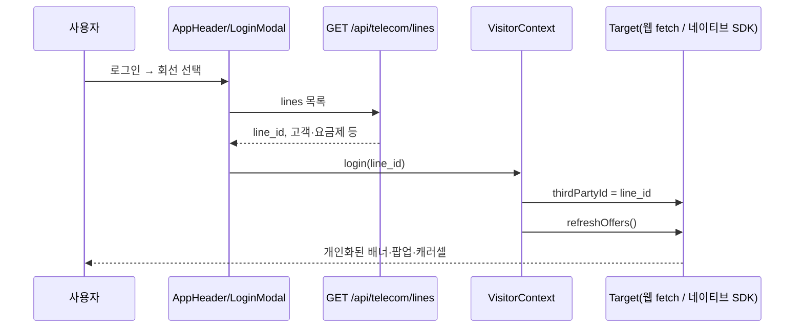

| 항목 | 내용 |
|------|------|
| **데이터** | `lgu_target_test.telecom_test_lines` — API `03` §4, 속성 `docs/files/telecom_attributes.csv` |
| **식별자** | 선택 **`line_id`** → 웹 `AT_THIRD_PARTY_ID` / 네이티브 `Target.setThirdPartyId` |
| **재조회** | `refreshOffers()` — 웹 bootstrap fetch 재실행, 네이티브 배너 mbox 재조회 |
| **로그아웃** | 세션 키 제거 + (네이티브) `resetExperience` → 익명 상태 |

## 7. HTTP 계약 요약 (예시)

**offers 응답 예:**

```jsonc
{
  "mbox": "target-local-mbox",
  "offers": [
    { "source": "mbox", "type": "json", "content": { "type": "event-popup", "title": "…" } }
  ],
  "tntId": "1234567.35_0",
  "target_cookie": { "name": "mbox", "value": "session#…|PC#…", "maxAge": 63072000 }
}
```

규칙 요약:

1. 요청·응답의 `tntId`/`thirdPartyId`(camel 또는 snake) + `target_cookie`/`target_location_hint`는 **순환**시킨다.
2. SDK 옵션 `target_cookie`에는 응답 쿠키의 **`value` 문자열**만 넣는다.
3. offers 전용: **`params`** → mbox `parameters`.
4. profile-test 전용: **`profile_params`** → mbox `profile_parameters`.
5. recommendation-test 전용: `entity_id`(필수)·`entity_category_id`·`recipient_id`·`price`(기본 1000). 응답 쿠키 키는 SDK 그대로 **`target_location_hint_cookie`**, 프론트는 그 `value`만 저장. Activity·디자인·카탈로그가 없으면 `recommendations`는 빌 수 있다.

### 부록 A. 용어: Delivery JSON `id` vs Python `VisitorId`

| 구분 | 이름 | 설명 |
|------|------|------|
| HTTP JSON 방문자 블록 키 | `id` | Adobe Delivery 명세의 식별자 블록 |
| 그 안의 필드 | `tntId`, `thirdPartyId`, … | REST 본문의 공식 키(camelCase). 레거시 `tnt_id`/`third_party_id` 수신도 지원 |
| Python SDK 타입 | **`VisitorId`** | 제너레이터가 `id` 스키마에 붙인 클래스명. `DeliveryRequest(id=VisitorId(...))` |

> `import VisitorId`는 "JSON 키가 VisitorId"라는 뜻이 아니라 **`id` 객체의 Python 타입**이다. 전송 JSON은 항상 `id`/`tntId`/`thirdPartyId`를 따른다.

---

# 3부. 네이티브(모바일 SDK) 연동

여기부터는 **Android/iOS 앱 전용**이다. 웹과 달리 **앱이 Adobe를 직접** 부른다(FastAPI를 거치지 않는다).

## 8. 네이티브 연동 전체 흐름

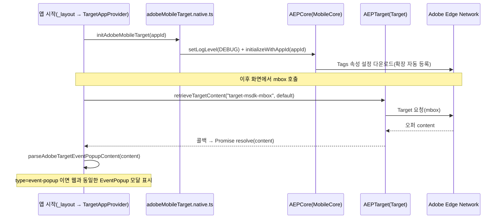

핵심 차이 한 줄: **웹은 백엔드가 `config.adobe.json`으로**, **네이티브는 앱이 `appId`(Tags 속성)로** Adobe와 통신한다.

## 9. 사전 준비 — Data Collection(Tags) 모바일 속성

1. Adobe **Data Collection → Tags**에서 **모바일 속성**을 만들고 확장을 설치한다. 현재 속성(`Test Woo sdev-ibank-mobile`)에 설치된 확장:
   - **Mobile Core** v3.0.2 (필수 — Lifecycle·Signal·Rules Engine 포함) · **Adobe Target** v3.0.0 (필수) · **Identity** v2.0.0 (ECID) · **AEP Assurance** v2.0.0 (디버깅) · **Profile** v3.0.0 (클라이언트측 프로필; Target mbox 테스트엔 선택)
2. 속성을 **Development 환경**으로 게시하면 **Environment File ID**(= `appId`)가 나온다.
   - 예: `ce8d64c4e8e1/9c6ed559c876/launch-a47665d87020-development`
3. 이 `appId`를 앱 설정에 넣는다(§14). SDK는 이 ID로 Adobe에서 설정(클라이언트 코드·Target 서버 등)을 내려받는다.

## 10. 설치한 패키지

`frontend/`에서 Adobe 공식 React Native 래퍼를 설치했다(v7.0.0). EAS 빌드의 prebuild가 네이티브(Gradle/Pods) 의존성을 **자동 연결**하므로, Android 안내에 나온 `build.gradle` 수정은 직접 하지 않는다.

| npm 패키지 | 제공 기능 |
|------------|-----------|
| `@adobe/react-native-aepcore` | `MobileCore`(초기화·로그), `Identity`/`Lifecycle`/`Signal` 내장 |
| `@adobe/react-native-aeptarget` | `Target`(mbox 조회·ID·세션) |
| `@adobe/react-native-aepassurance` | `Assurance`(실기기 디버깅 세션) |

> Target 테스트에는 위 3개로 충분하다. UserProfile을 RN에서 직접 제어해야 하면 `@adobe/react-native-aepuserprofile`을 추가한다.

### 10.1 설치 확장 ↔ 프로젝트 검증 (현재 속성 기준)

`MobileCore.initializeWithAppId(appId)`는 **앱 네이티브 빌드에 포함된 확장만 자동 등록**한다(네이티브 의존성은 위 npm 래퍼가 autolink). Tags 속성에 설치된 확장과 프로젝트의 대응 상태:

| Tags 설치 확장 | 프로젝트 네이티브 대응 | 상태 |
|----------------|------------------------|------|
| **Mobile Core** v3.0.2 (Lifecycle·Signal·Rules 포함) | `@adobe/react-native-aepcore` (`MobileCore`/`Lifecycle`/`Signal`) | ✅ 적용 |
| **Identity** v2.0.0 (ECID) | `@adobe/react-native-aepcore` (`Identity`) | ✅ 적용 |
| **Adobe Target** v3.0.0 | `@adobe/react-native-aeptarget` (`Target`) | ✅ 적용 |
| **AEP Assurance** v2.0.0 | `@adobe/react-native-aepassurance` (`Assurance`) | ✅ 적용 |
| **Profile** v3.0.0 (UserProfile) | 대응 npm 패키지 미설치 | ⚠️ 미적용(선택) |

> **결론:** Target mbox·event-popup 테스트에 필요한 확장(Core·Identity·Target·Assurance)은 **모두 적용됨**. **Profile(UserProfile)** 확장만 네이티브 빌드에 대응 패키지가 없어 등록되지 않는다.
> - 이는 **현재 테스트 범위에서 문제 없음** — Target의 **서버측 프로필**(mbox `profileParameters`·Profile Script)은 Target 확장이 처리하며, UserProfile은 **클라이언트측** 프로필 저장/룰 소비용으로 별개다.
> - 클라이언트측 Profile까지 Tags 설정과 완전 일치시키려면 `@adobe/react-native-aepuserprofile`을 설치하고 **EAS 새 빌드**를 만들면 된다.

## 11. 네이티브 SDK가 제공하는 함수(우리가 쓰는 것)

| 함수 | 용도 |
|------|------|
| `MobileCore.setLogLevel(LogLevel.DEBUG)` | SDK 로그 레벨 |
| `MobileCore.initializeWithAppId(appId)` | **초기화**. v7은 설치된 확장을 **자동 등록** |
| `Target.retrieveLocationContent([req], params)` | mbox 콘텐츠 조회(콜백으로 반환) |
| `new TargetRequestObject(name, params, defaultContent, cb)` | 조회 요청 1건(콜백 포함) |
| `new TargetParameters(parameters?, profileParameters?, …)` | mbox 파라미터 |
| `Target.getTntId()` / `getThirdPartyId()` / `getSessionId()` | 방문자 식별자 조회(Promise) |
| `Target.resetExperience()` | 식별자 초기화 |
| `Assurance.startSession(url)` | Assurance 디버깅 세션 시작 |

> **현재 와이어링 범위:** 위 함수까지 연결돼 있어 **오퍼 조회·식별자·디버깅·event-popup 표시**가 동작한다.
> 활동 리포트의 **노출/클릭(전환) 측정**은 SDK가 `Target.displayedLocations([mbox], params)`·`Target.clickedLocation(name, params)`를 제공하지만 **아직 호출하지 않는다**(필요 시 확장 지점).

## 12. 코드 구조

```text
frontend/adobe_frontend/target_frontend/
├─ utils/sessionStore.ts            ← 웹/네이티브 범용 저장소
├─ utils/targetHttp.ts              ← 3개 fetch 공통 헬퍼(API URL·쿠키·세션·응답반영)
└─ native/
   ├─ adobeMobileTarget.types.ts    ← 공용 타입(TargetIds)
   ├─ adobeMobileTarget.ts          ← 웹 기본(no-op) + 타입 소스
   └─ adobeMobileTarget.native.ts   ← 네이티브 실구현(Adobe 패키지 import)

frontend/app/native-target-test.tsx ← 테스트 화면(/native-target-test)
frontend/components/AppFooter.tsx    ← "SDK 테스트" 탭
frontend/adobe_frontend/.../app/targetApp.tsx ← 초기화 호출 지점
```

### 12.1 범용 세션 저장소 — `sessionStore.ts`

- 웹의 `sessionStorage`는 네이티브에 없다. 그래서 **같은 동기 API**(`sessionGetItem`/`sessionSetItem`/…)를 양쪽에서 쓰도록 감쌌다.
  - **웹:** `sessionStorage`에 그대로 위임(기존 동작·세션 스코프 유지).
  - **네이티브:** 동기 읽기용 **메모리 캐시** + `AsyncStorage` write-through(앱 재시작에도 유지). 앱 시작 시 `hydrateSessionStore()`로 캐시를 1회 적재.

## 13. 왜 웹/네이티브를 "파일"로 분리하나 (가장 중요)

Adobe Mobile SDK는 **네이티브 전용**이라 웹 번들에 들어가면 안 된다. 그래서 **Metro의 플랫폼별 파일 선택** 규칙을 이용한다.

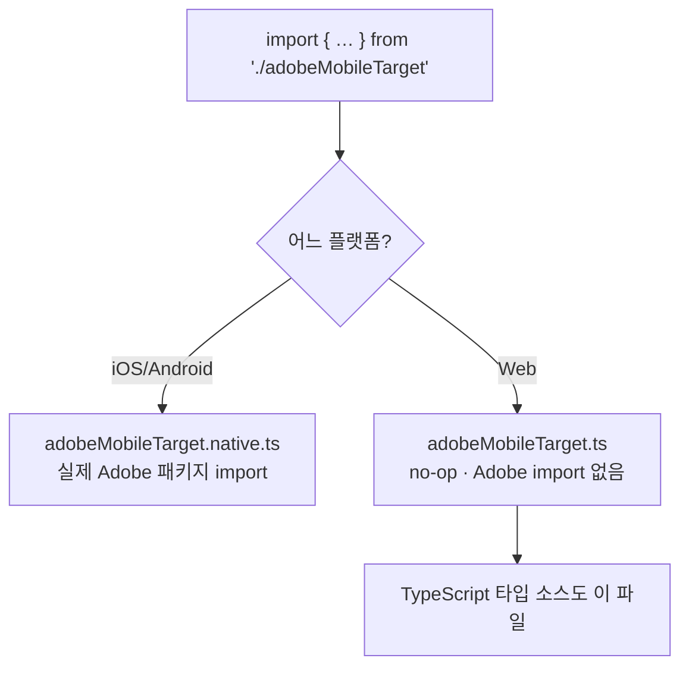

- 네이티브는 `*.native.ts`, 웹은 `*.web.ts`가 없으면 **확장자 없는 base `*.ts`**로 폴백한다.
- 그래서 **웹 번들에는 Adobe 네이티브 패키지가 전혀 포함되지 않는다.**
- **실측 검증:** `expo export` 결과, **웹 번들의 `AEPTarget` 참조 = 0개**, Android 번들에는 포함됨. 즉 웹 동작은 그대로다.

### 13.1 세 파일의 역할

| 파일 | 플랫폼 | 내용 |
|------|--------|------|
| `adobeMobileTarget.types.ts` | 공용 | `TargetIds` 타입(`tntId`/`thirdPartyId`/`sessionId`) |
| `adobeMobileTarget.ts` | 웹/타입 | 모든 함수가 **no-op**. `init→false`, `retrieve→defaultContent`, `getIds→null`. Adobe import 없음 |
| `adobeMobileTarget.native.ts` | iOS/Android | 실제 `MobileCore`·`Target`·`Assurance` 호출 |

> 호출하는 화면(`native-target-test.tsx` 등)은 항상 확장자 없이 `@adobe/native/adobeMobileTarget`를 import한다. 어떤 파일이 선택될지는 Metro가 플랫폼에 따라 자동 결정한다.

## 14. 초기화·설정·테스트 화면

### 14.1 초기화 위치 — `targetApp.tsx`

앱 루트 Provider의 마운트 시점에 호출한다(모두 **웹에서는 no-op**). 모바일 전용 설정은 `config.mobile_env` 하위에 모여 있다.

```ts
useEffect(() => {
  void hydrateSessionStore();                               // (네이티브) 세션 캐시 적재
  void (async () => {
    await initAdobeMobileTarget(                             // (네이티브) SDK 초기화 + Property 토큰 주입
      config.mobile_env?.adobe_mobile_app_id ?? "",
      config.mobile_env?.adobe_target_property_token,
    );
    const url = config.mobile_env?.assurance_session_url;    // (네이티브) Assurance 자동 세션
    if (url) startAssuranceSession(url);
  })();
}, []);
```

### 14.2 설정 키 — `mobile_env`

- 모바일 전용 값은 `frontend/env/config.{dev,prd}.json`의 **`mobile_env`** 블록에 모은다(웹 값과 명확히 구분).
  - `adobe_mobile_app_id`(Environment File ID), `adobe_target_property_token`, `assurance_session_url`/`assurance_session_pin`, `adobe_sdk_mboxes`(**offer**=XT / **global**=A·B / **rec**=추천, 각 화면이 자기 mbox만 사용해 활동 충돌 방지).
- `frontend/utils/loadConfig.ts`의 `AppConfig.mobile_env`(타입 `MobileEnvConfig`)로 로드.
- dev·prd 둘 다 development File ID를 기입(릴리스 빌드는 `config.prd.json`을 읽기 때문). 운영 배포 시 prd 값을 production File ID로 교체.

> ⚠️ **빌드와 설정의 관계:** EAS의 `preview`/`production` 빌드는 릴리스(`__DEV__=false`)라 **`config.prd.json`을 읽는다.** 그래서 실기기 테스트가 바로 되도록 dev·prd 양쪽에 development `appId`를 넣었다. **실제 운영 배포 시에는 `config.prd.json`의 값을 production 환경 File ID로 교체**해야 한다.

### 14.3 테스트 화면(3종) — XT / A·B / 추천 SDK

화면 구현은 `frontend/adobe_frontend/target-native-frontend/`에 모으고, `app/`의 라우트 파일은 얇은 re-export만 둔다. 셋 다 웹에서 열면 "네이티브 빌드에서 테스트하세요" 안내 배너만 보인다.

| 화면 | 라우트 | 푸터 라벨 | 핵심 |
|------|--------|-----------|------|
| **XT 테스트** | `/xttest` | XT 테스트 | **offer mbox**(`target-msdk-mbox`)로 **오퍼 가져오기**(retrieveTargetContent) → 반환 콘텐츠 표시. event-popup 오퍼면 팝업(§14.4). |
| **A/B 테스트** | `/abtest` | A/B 테스트 | **global mbox**(`target-global-msdk-mbox`) 진입 시 자동 오퍼 → 중앙 이미지를 **디폴트 vs 오퍼(JSON `imageUrl`)** 로 나란히 비교(자동 리사이즈). |
| **추천 SDK** | `/recommendation` | 추천 SDK | **rec mbox**(`target-rec-msdk-mbox`)로 **추천 데이터 적재 루프 + 추천 가져오기**(§15). XT 와 분리. |

- **공통:** 방문자 ID(tntId/thirdPartyId/sessionId) 조회·새로고침, **경험 초기화**(resetExperience + `MobileCore.resetIdentities()` → tntId·ECID 모두 재발급). 공용 `VisitorPanel`/`SupportBanner`/`commonStyles`(`common.tsx`)를 공유.
- **SDK init·Assurance는 전역 1회**(`targetApp.tsx`, §14.1) — 화면별 입력폼 없음. **mbox는 환경변수(`config.mobile_env.adobe_sdk_mboxes`)만** 사용(하드코딩 폴백 없음 → 누락 시 배너 경고).
- 하단 푸터는 탭 7개를 **두 줄(4 + 3)** 로 배치: (1행) 메인·프로필 테스트·추천 테스트·스크롤 테스트 (2행) XT 테스트·A/B 테스트·추천 SDK.

### 14.4 event-popup 팝업 — 웹/네이티브 공용

웹(`main.tsx`)에서 `{ "type":"event-popup", "title", "body", "buttonText" }` JSON 오퍼로 띄우던 모달을 **모바일 SDK 경로에서도 그대로** 재사용한다.

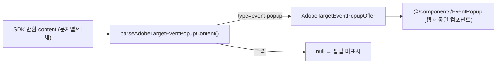

- **파서 공용화:** `targetOfferParser.ts`의 콘텐츠 파싱 코어(`_coerceContentValue`)를 웹(`{offers:[{content}]}`)과 네이티브(단일 content 값)가 공유한다. 네이티브용 진입점이 `parseAdobeTargetEventPopupContent(content)`.
- **컴포넌트 재사용:** 네이티브 테스트 화면은 웹과 **동일한 `@/components/EventPopup`**을 렌더한다(`offer=null`이면 미표시). 즉 팝업 UI/동작은 한 곳에서 관리된다.
- 웹 흐름(`parseAdobeTargetOffersPayload`→Context→`main.tsx`)은 **전혀 바뀌지 않았다**.

### 14.5 SDK 객체 레퍼런스 — `@adobe/react-native-aeptarget`

`adobeMobileTarget.native.ts`가 import하는 클래스/모듈은 **모두 Adobe가 제공**하는 모바일 Target SDK(네이티브 AEPTarget의 React Native 래퍼)다. 직접 만든 타입이 아니다.

| 객체 | 역할 | 본 프로젝트 사용(생성자/호출) |
|------|------|-------------------------------|
| **`Target`** | Target 메인 모듈(메서드 모음): `retrieveLocationContent`·`prefetchContent`·`getTntId`·`getThirdPartyId`·`setThirdPartyId`·`resetExperience`·`getSessionId`·`clickedLocation` 등 | `Target.retrieveLocationContent([req], params)` |
| **`TargetParameters`** | 한 요청에 실어 보낼 파라미터 묶음(mbox 파라미터 + profile 파라미터 + product + order) | `new TargetParameters(mbox, profile, product, order)` |
| **`TargetRequestObject`** | mbox **1개** 요청 단위(이름·파라미터·기본값·콜백) | `new TargetRequestObject(name, params, default, (err, content) => …)` |
| **`TargetProduct`** | 상품 정보(productId, categoryId) — 추천/주문 컨텍스트 | `new TargetProduct(entityId, categoryId)` |
| **`TargetOrder`** | 주문 정보(orderId, total, purchasedProductIds[]) — 구매 이벤트 | `new TargetOrder(orderId, total, [ids])` |

**공식 문서(설명을 볼 곳)**

- 모바일 Target API 레퍼런스(메서드·클래스 전체, 상단 탭에서 언어 선택): https://developer.adobe.com/client-sdks/solution/adobe-target/api-reference
- React Native Target 패키지 README(RN 시그니처·예제 — 본 코드와 가장 일치): https://github.com/adobe/aepsdk-react-native/tree/main/packages/target
- npm 패키지: https://www.npmjs.com/package/@adobe/react-native-aeptarget

> 실제 설치 버전 기준으로 보려면 `frontend/package.json`의 `@adobe/react-native-aeptarget` 버전을 확인해 해당 태그의 README를 참조한다.

## 15. 네이티브 추천(Recommendations) 완전 가이드

추천(Recommendations)은 "이 사용자/이 상품과 관련해 보여줄 다른 상품들"을 Adobe가 **자동 계산**해 돌려주는 기능이다. A/B·XT 오퍼처럼 사람이 정한 고정 콘텐츠를 주는 게 아니라, **앱이 쌓아 둔 행동 데이터(조회·구매)를 학습한 알고리즘**이 매번 후보 상품을 골라준다. 그래서 ① 데이터를 먼저 쌓고 → ② Adobe가 학습하고 → ③ 조회하면 결과가 나오는, **순서가 있는 기능**이다.

### 15.1 구성 요소 (활동을 만들기 위해 필요한 것)

| 요소 | 무엇인가 | 우리 설정값 |
|------|----------|-------------|
| **Catalog(엔티티)** | 추천 대상 상품 목록. `entity.id`(필수)·name·categoryId 등 속성 | 메뉴 60개(`entity.id`=21~60) |
| **Collection(컬렉션)** | 추천 후보를 한정하는 상품 묶음(카테고리 등) | Test Woo Star Product 02 (sb, sf) |
| **Criteria(기준)** | 어떤 알고리즘으로 추천할지 | Item-Based · `BOUGHT_CF based on Most Viewed Item` |
| **Design(디자인)** | 추천 결과를 어떤 JSON/HTML로 내보낼지(템플릿) | Test Woo Start Product - Json (`meta` + `items` 5) |
| **Activity(액티비티)** | mbox + Criteria + Design + Audience 를 묶어 게시 | `target-rec-msdk-mbox` 에 연결 |
| **mbox(위치)** | 앱이 추천을 요청하는 위치 이름 | `target-rec-msdk-mbox`(추천 전용 — XT 의 `target-msdk-mbox` 와 분리) |

> 디자인 출력 계약(우리 활동):
> ```json
> { "meta": { "algorithmName": "...", "keyName": "..." },
>   "items": [ { "entityId": "...", "name": "...", "categoryId": "...", "stCode": "..." }, … 최대 5 ] }
> ```
> 추천이 5개 미만이면 `$entity5.id` 같은 **미해결 토큰**이 올 수 있어, 앱(`parseRecommendations`)이 토큰·빈 슬롯을 걸러낸다.

### 15.2 전체 흐름 (데이터 적재 → 학습 → 조회)

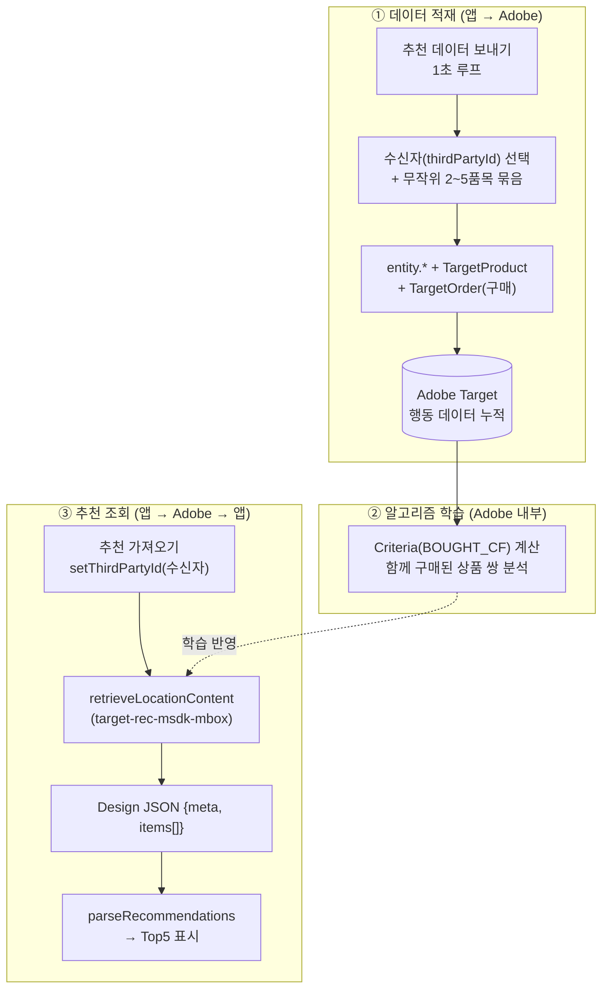

### 15.3 만드는 순서 (Target UI 세팅)

1. **Catalog 적재**: `entity.id` 기준 상품이 Adobe에 있어야 한다. 우리는 앱이 `entity.*` 파라미터를 함께 보내며 자동 등록한다(속성은 **61일 만료** → 주기적 재전송 필요).
2. **Collection 생성**: 추천 후보 범위 지정(예: 카테고리 sb/sf).
3. **Criteria 생성**: Algorithm Type=Item-Based, Algorithm=People Who Bought This/Bought That, Key=Most Viewed Item, **Backup Content** 설정(§15.5).
4. **Design 생성**: 결과 JSON 템플릿(`$entity1.id` … 5개 슬롯).
5. **Activity 생성**: Recommendations 활동 → **mbox=`target-rec-msdk-mbox`**(추천 전용) 지정 → Criteria·Design·Collection·Audience 연결 → **게시(Activate)**. ※ XT 활동의 `target-msdk-mbox` 와 분리해야 XT 오퍼가 섞이지 않는다.

> 게시되지 않았거나 mbox 이름이 다르면 조회 시 default/빈 응답만 온다(§18 FAQ).

### 15.4 데이터 적재(삽입) 순서 — 앱 동작

"추천 데이터 보내기"를 누르면 1초마다 다음을 반복한다(멈출 때까지).

1. 수신자 10명을 **순서대로 1명** 선택(`RECIPIENT_IDS` 순환).
2. `resetExperience()` → `setThirdPartyId(수신자)` — 한 기기에서 **수신자별 프로필을 분리**(reset이 thirdPartyId까지 지우므로 reset→set 순서).
3. 메뉴에서 **중복 없이 2~5개** 무작위 선택.
4. `TargetParameters(entity.*(대표 1개), TargetProduct, TargetOrder(orderId, 합계, [선택 id들]))` 구성.
5. `retrieveLocationContent(target-rec-msdk-mbox, params)` 로 전송 → Adobe에 **구매 이벤트 누적**.

> 왜 묶음인가: `BOUGHT_CF`(함께 구매)는 **한 주문/한 사용자가 함께 산 상품 쌍**으로 학습된다. 1개만 보내면 쌍이 안 생기므로, 2~5개를 묶어 보내 co-purchase 쌍을 빠르게 만든다. (60개 전부 묶으면 모든 상품이 서로 연관돼 신호가 희석 → 비권장)

### 15.5 "기본 디폴트로 보여줄 것" — 정할 수 있나?

**답: Target에서 정할 수 있고(권장), 앱에서도 마지막 안전망을 둘 수 있다.** "무엇을 보여줄지"는 아래 3개 층으로 결정된다.

| 층 | 누가/어디서 | 동작 |
|----|-------------|------|
| ① **Criteria 알고리즘** | Target Criteria | `BOUGHT_CF` 결과를 우선 채운다 |
| ② **Backup Content** | **Target Criteria 설정** | 결과가 디자인 슬롯보다 **적을 때** 채우는 방법:<br/>· **Partial Design Rendering**: 부족분은 빈칸으로 둠<br/>· **Show Backup Recommendations**: 빈 슬롯을 **사이트 인기(최근 1주, 최다 조회 top 500)** 상품으로 자동 채움<br/>· 둘 다 끄고 부족하면 → 템플릿 대신 **default content** 표시 |
| ③ **Default content / 앱 폴백** | Target 활동 default + **앱 코드** | 활동이 아예 안 떨어지거나(미게시·오류·오프라인) 응답이 비면 → 앱이 자체 기본 UI 표시(`retrieveLocationContent`의 `defaultContent`) |

- 너의 criteria는 **Show backup recommendations = Yes** 라, 추천이 부족하면 **인기 상품으로 Adobe가 자동으로 채운다(앱 구현 불필요).**
- "이 활동/이 mbox가 추천을 전혀 못 줄 때의 최종 기본값"은 **Target의 default content**(활동에서 지정) 또는 **앱의 기본 UI**(시스템 구현) 중에서 정한다. 즉 **둘 다 가능**하다.
- 더 정교하게 "부족 시 일반 인기 대신 다른 알고리즘으로 채우기"를 원하면 **Criteria Sequence**(최대 5개 기준 순차)로 백업 기준을 지정할 수 있다.

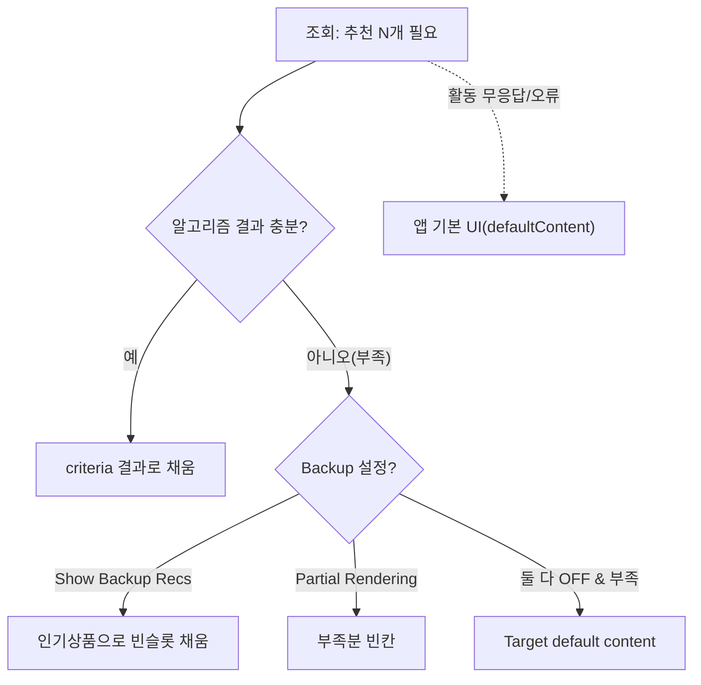

### 15.6 가드레일(공식 제한 — 출처: Adobe Target limits)

| 항목 | 제한 |
|------|------|
| `purchasedProductIds` 개별 값 | **50자/개**(초과 시 잘림) |
| `purchasedProductIds` 전체(콤마 연결) | **총 250자**(초과 시 400 에러) |
| mbox 파라미터(표준) | mbox당 500개 (모바일 Batch Delivery API는 50개) |
| entity 속성 만료 | **61일** → 월 1회 이상 재전송 권장 |

- 우리 `entity.id`는 2자리라 2~5개 묶음은 길이 제한에 한참 못 미친다(여유).
- **학습엔 시간·데이터량이 필요**하다. 특히 구매 데이터는 희소해 `BOUGHT_CF`는 늦게 동작 → 초기에는 backup(인기)만 나올 수 있다.

### 15.7 우리 구현 매핑

| 기능 | 파일 |
|------|------|
| 화면(적재 루프 + 조회) | `target-native-frontend/RecommendationScreen.tsx` |
| 데이터·파서 | `target-native-frontend/recommendationData.ts` (`RECIPIENT_IDS`, `MENU_ENTITIES`, `pickRandomEntities`, `parseRecommendations`) |
| SDK 전송/방문자 | `target-native-frontend/native/adobeMobileTarget(.native).ts` (`sendTargetRecommendationData`, `setTargetVisitor`) |
| 라우트/푸터 | `app/recommendation.tsx`, `components/AppFooter.tsx`("추천 SDK" 탭) |

## 16. 네이티브 빌드·테스트 방법(EAS)

네이티브 모듈이 추가됐으므로 **OTA 업데이트가 아니라 새 빌드**가 필요하다. 본 프로젝트는 **서버에서 `git pull` 후 `eas build`** 하는 흐름을 기준으로 한다.

**저장소 루트 `/.easignore`:** EAS는 **git 저장소 루트** 전체를 아카이브로 올린다(`frontend/` 앱이어도 루트가 기준). `loadConfig.ts`가 `frontend/env/config.{dev,prd}.json`을 정적 import 하는데, 두 파일은 Git 제외(민감정보)라 `.gitignore`만 쓰면 아카이브에 없어 **"Bundle JavaScript"** / `Unable to resolve module ../env/config.dev.json` 이 난다. **루트** `.easignore`는 `backend/`·`docs/` 등을 제외하되 **frontend env config JSON은 업로드에 포함**한다. `frontend/.easignore`는 EAS가 읽지 않으므로 사용하지 않는다.

**방법 A — git (권장)**

```bash
# 로컬: .easignore 커밋·푸시 후
# 서버:
cd /path/to/at_test_page && git pull
# frontend/env/config.{dev,prd}.json 존재 확인(example 복사·값 입력, Git 제외 파일)
cd frontend
eas build --platform android --profile production --non-interactive
```

**검증 (업로드 전)**

```bash
cd /path/to/at_test_page
git check-ignore -v .easignore    # 무시되지 않아야 함(추적·업로드 가능)
```

빌드 로그에서 `✔ Uploaded to EAS` 이후 **Bundle JavaScript** 단계까지 통과하면 `config.dev.json`·`config.prd.json`이 아카이브에 포함된 것이다.

```bash
# preview APK 등 다른 프로필
eas build -p android --profile preview
# 설치 후: 앱 실행 → 하단 "추천 SDK" 탭 → ① 추천 데이터 보내기 → ② 추천 가져오기
# Assurance: 전역 자동 세션(환경변수). 실기기 PIN으로 이벤트 확인
```

---

# 4부. 운영

## 17. 설정 파일 총정리

| 파일 | 길 | 용도 | Git |
|------|----|------|-----|
| `backend/env/config.adobe.json` | 웹 | `administration` + `mboxes`(offer/recs/bootstrap/**banner_mbox_names**) | **제외**. `config.adobe.example.json` 복사 |
| `backend/env/config.{dev,prd}.json` | 백엔드 | `cors_origins`, `db.*`, **`telecom_db.*`** | 포함(dev는 로컬 비밀 제외 권장) |
| `frontend/env/config.{dev,prd}.json` | 네이티브 | **`mobile_env`**(`adobe_mobile_app_id`·`adobe_target_property_token`·Assurance·**`adobe_sdk_mboxes`**: offer/global/rec/**banner_sdk_mbox_names**)·`api_url` | **제외**. example 복사 |
| `/.easignore` (저장소 루트) | EAS | 아카이브 제외 목록 — **frontend env config 포함**, `backend/`·`docs/` 제외(§16) | 포함 |

- CORS: `app/main.py`가 `GET/POST/OPTIONS`, `allow_private_network`, dev에서 localhost·127.0.0.1·`[::1]` 임의 포트 정규식을 처리(상세는 `03` §3.4).

## 18. 이식·점검 체크리스트

**웹(서버 프록시)**

1. `backend/env/config.adobe.example.json` 복사 → `config.adobe.json` 작성(`administration`·`mboxes`·**`banner_mbox_names`**, ASCII).
2. `backend/env/config.*.json`에 **`telecom_db`** 작성(회선 API).
2. `register_target_routes(app)` 호출 + CORS(`POST`·`OPTIONS`, 필요 시 `allow_private_network`).
3. 동기 SDK 호출은 **`asyncio.to_thread`** 유지.
4. 프론트 fetch 베이스 URL은 `api_url`/`api_base_url`(`frontend/env`).
5. 메인·프로필: `tntId`+`thirdPartyId`+쿠키·`session_id` 일관성. 추천: Activity Location 문자열이 `mboxes.recs_mbox_name`과 일치.
6. 장애 시에만 `AT_DEBUG_DELIVERY=1`.
7. Expo `@adobe/*` 경로가 `tsconfig.json`과 일치.

**네이티브(모바일 SDK)**

8. Tags 모바일 속성에 확장 설치 + Environment File ID 확보.
9. `frontend/env/config.{dev,prd}.example.json` 복사 → `config.{dev,prd}.json` 작성(git 제외). `mobile_env.adobe_mobile_app_id`(운영은 production File ID)·`adobe_target_property_token`·Assurance 세션 값 입력. **EAS 빌드 전** 빌드 머신에 해당 파일 존재·**루트** `/.easignore` 커밋 여부 확인(§16).
10. Adobe 패키지 import는 **`*.native.ts`에만** — 웹 base `*.ts`는 no-op 유지(웹 번들 오염 금지).
11. 네이티브 변경 후에는 **EAS 새 빌드**(OTA 불가).

## 19. 문제 해결(FAQ)

| 증상 | 원인 / 조치 |
|------|-------------|
| 웹에서 HTTP 400 | 설정 누락/비ASCII(`config.adobe.json`) 또는 mbox 이름 오타 → 백엔드 로그 확인 |
| 웹에서 HTTP 502 | Adobe 응답 실패. `AT_DEBUG_DELIVERY=1`로 요청/응답 확인 |
| `recommendations`가 빈 배열 | Adobe Recommendations Activity·디자인·카탈로그 미구성, 또는 `recs_mbox_name` 불일치 |
| 네이티브에서 오퍼가 default만 옴 | `appId` 미설정(빈 문자열) / 잘못된 환경 File ID / Activity 미게시 |
| 추천(추천 SDK)이 빈 결과/인기상품만 옴 | 학습 데이터 부족(구매 데이터 희소). "추천 데이터 보내기"로 누적 후 재시도. backup=Yes면 인기상품으로 채워짐(§15.5). Activity 게시·mbox 일치 확인(§15.3) |
| 추천 결과에 `$entity5.id` 같은 토큰 표시 | 추천이 디자인 슬롯보다 적을 때의 미해결 토큰 — 앱이 걸러내며(§15.1) backup 설정으로 슬롯을 채울 수 있음 |
| Tags의 Profile 확장이 앱에서 동작 안 함 | RN에 `@adobe/react-native-aepuserprofile` 미설치라 UserProfile 미등록(§10.1). Target 서버측 프로필과는 무관 — 필요 시 설치 후 EAS 새 빌드 |
| event-popup 팝업이 안 뜸 | 반환 콘텐츠가 `type:event-popup` JSON인지 확인(§14.4·**부록 C.3.1**). 활동 오퍼 타입/내용·mbox 이름 점검 |
| top/bottom 띠배너가 placeholder만 보임 | **웹**: `banner_mbox_names` Activity 또는 bootstrap 내 `type` JSON 확인. **네이티브**: `banner_sdk_mbox_names`·Activity 게시(부록 C.3.2) |
| 띠배너가 잠깐 placeholder 후 바뀜(FOUC) | 정상 수정됨 — `bannersReady` 전 미렌더. bootstrap 실패 시 placeholder 유지 |
| 회선 로그인 후 오퍼가 안 바뀜 | `line_id`가 Target `thirdPartyId`로 들어갔는지·Audience가 `line_id`/profile 기준인지·`refreshOffers` 호출 여부(§6.3) |
| 웹 빌드가 Adobe 네이티브 때문에 깨짐 | `*.native.ts`에 import가 새어 들어갔는지 확인(base `*.ts`는 no-op이어야 함) |
| EAS "Bundle JavaScript" 실패 / `Unable to resolve module ../env/config.dev.json` | 아카이브에 config 없음 — **저장소 루트** `/.easignore` 사용(`frontend/.easignore` 무효)·빌드 머신에 `frontend/env/config.*.json` 존재·`git pull` 후 재빌드(§16) |
| 회선 API 503 `database_unavailable` | `telecom_db` 연결·인증·`telecom_test_lines` SELECT 권한 — `03` §4.3 |
| 네이티브 변경이 앱에 반영 안 됨 | OTA가 아니라 **EAS 새 빌드** 필요 |

## 부록 B. 네이티브 백엔드(서버사이드) 연동 — Python/Java SDK & 하이브리드

네이티브 앱도 단말 Mobile SDK 대신(또는 함께) **앱 → 내 백엔드 컨트롤러(Python/Java SDK) → Adobe Target Delivery API** 구조로 연동할 수 있다. 두 방식 모두 결국 **같은 Delivery API**를 호출하므로, 서버 SDK는 호출 주체(웹/앱)를 가리지 않는다. 실제로 본 프로젝트의 **웹 경로가 이미 이 서버사이드 구조**(`backend/adobe_backend`, `target-python-sdk`)다.

### B.1 두 가지 연동 아키텍처

```
[A] 클라이언트사이드 (현재 네이티브)
  앱 ──(AEPTarget, Tags 모바일 익스텐션)──▶ Adobe Target Delivery API
       └ ECID/tntId 자동관리(Identity 익스텐션), 환경 = environmentFileId

[B] 서버사이드 (현재 웹 백엔드와 동일)
  앱 ──HTTP──▶ 내 백엔드(Python/Java SDK) ──▶ Adobe Target Delivery API
                └ 식별자/파라미터를 백엔드가 직접 구성, 환경 = at_property + client/orgId
```

### B.2 비교

| 항목 | [A] Mobile SDK + Tags | [B] 백엔드 SDK(서버사이드) |
|------|----------------------|---------------------------|
| 호출 주체 | 단말 SDK | 내 백엔드 |
| Tags 모바일 속성(`environmentFileId`) | **사용** | **불필요**(`client`/`orgId`/`at_property`만) |
| ECID/tntId | SDK가 **자동** 생성·보관(Identity) | 백엔드가 **직접** 관리·전달 |
| 방문자 식별 | ECID 중심(+`thirdPartyId`) | 보통 **`thirdPartyId`(=recipient_id) 중심** |
| 자동 수집(Lifecycle/A4T/오프라인 큐) | 있음 | 없음(직접 파라미터 전송) |
| 오퍼 적용 | 앱 코드가 form 콘텐츠 해석 | 동일(앱이 백엔드 응답 해석) |

### B.3 핵심: 식별자(Identity) 스티칭 — ECID 주입과 하이브리드

**ECID**(Experience Cloud ID = `marketing_cloud_visitor_id`)는 Adobe가 "같은 사용자"를 인식하는 대표 방문자 ID다.

- [A] Mobile SDK는 Identity 익스텐션이 단말에 ECID를 자동 보관하고 모든 호출에 실어 보낸다.
- [B] 백엔드는 그냥 요청을 만들면 ECID가 없어 **다른 방문자**로 인식된다. → 한 사람이 [A]·[B]를 섞어 쓰면 Target은 **두 명**으로 봐서 A/B 배정이 갈리고 세그먼트·A4T 리포트가 쪼개진다.

**해결(= 하이브리드):** 단말 SDK가 가진 ECID를 앱이 백엔드로 전달하고, 백엔드가 delivery 요청의 `VisitorId.marketing_cloud_visitor_id` 에 그 값을 주입한다. 그러면 두 경로가 같은 ECID를 가리켜 Target이 한 사람으로 묶는다.

```
[A] 단말 SDK ─ECID(자동)──────────────────────▶ Target
                  │ (같은 ECID 공유)
[B] 앱 ─ECID전달─▶ 내 백엔드 ─VisitorId.marketing_cloud_visitor_id=ECID─▶ Target
```

- 앱에서 ECID 획득: `Identity.getExperienceCloudId()` (AEP Identity 익스텐션).
- 백엔드 주입 지점: `build_visitor_id(...)`에 `marketing_cloud_visitor_id`(ECID)를 추가해 `VisitorId`에 실어 보낸다(예시 패키지 `adobe_backend_example/base_model_python_sdk.py`의 `build_visitor_id` 확장).

#### 식별자 발급 주체 — "임의 생성"은 thirdPartyId뿐, 나머지는 "받아서 재사용"

ECID/`tntId`는 **임의로 만들어 넣는 값이 아니다.** Adobe가 발급한 값을 **받아 저장 → 이후 동일하게 재사용**한다. 직접 정해서 넣는 건 `thirdPartyId`뿐이다.

| 식별자 | 누가 만드나 | 방식 |
|--------|------------|------|
| `thirdPartyId`(=recipient_id) | **내가** 지정 | 내 CRM 키 — 임의로 정해서 전송하는 유일한 ID |
| `tntId` | **Adobe Target** 발급 | 응답으로 받음 → 저장 → 재요청 시 그대로 전송(스티키니스 핵심) |
| `ECID`/`marketing_cloud_visitor_id` | **Adobe ID 서비스** 발급 | 받아서 저장 → 재사용. 임의 생성 금지 ❌ |

- **하이브리드([A]+[B])**: 단말 SDK가 이미 보관한 ECID를 `Identity.getExperienceCloudId()`로 **읽어** 백엔드로 넘겨 재사용(새로 만들면 단말과 다른 사람이 됨).
- **순수 서버사이드([B])**: 첫 호출에 식별자를 안 넣으면 Adobe가 발급해 응답으로 돌려준다 → 그 값(`tntId` 등)을 앱/세션/DB에 저장했다가 다음 호출에 재전송(웹 경로가 이미 쓰는 패턴, §4).

### B.4 언제 무엇을 쓰나 (권장)

| 상황 | 권장 |
|------|------|
| CRM 키(recipient_id) 기반 추천/오퍼만 필요 | **[B] 순수 서버사이드** — Tags 모바일 속성 없이 `target-python-sdk`(또는 Java SDK) + `at_property` + `thirdPartyId`만으로 동작. 스티칭 고민 최소 |
| 단말 자동 컨텍스트·A4T·자동 오퍼가 필요 | **[A] Mobile SDK 유지** |
| 둘 다 필요(자동 수집 + 서버 결정) | **[A]+[B] 하이브리드** — ECID 공유로 식별자 일치 |

> 본 프로젝트 기준: 추천/AB 흐름이 `thirdPartyId = recipient_id`로 이미 동작하므로, 네이티브를 서버사이드로 돌릴 때 같은 `thirdPartyId`만 일관되게 넘기면 같은 프로필로 묶인다. A4T·ECID 연속성이 필요할 때만 ECID 주입(하이브리드)을 추가한다.

## 부록 C. JSON 오퍼 타입별 적용 가이드 (팝업·띠배너·캐러셀·기타)

Adobe Target **Form-based Experience** 활동에서 오퍼 콘텐츠를 **JSON**으로 내려주면, 앱이 `content`를 파싱해 화면에 반영한다.  
웹은 백엔드 `POST /api/target/offers`(또는 profile-test) 응답의 `{ offers: [{ content }] }` 형태, 네이티브는 Mobile SDK가 돌려주는 **단일 content 문자열/객체**를 각각 파서가 처리한다.

### C.1 공통 규칙

| 항목 | 설명 |
|------|------|
| **content 형태** | 객체 `{ … }` 또는 JSON **문자열**. 문자열이 한 번 더 JSON으로 감싸진 **이중 문자열**도 파서가 1단계 더 파싱한다. |
| **구분 키** | 대부분 `type` 필드로 UI를 고른다. `type`이 없으면 **캐러셀 오퍼**(§C.4) 후보로 본다. |
| **웹 파서** | `targetOfferParser.ts` → `parseAdobeTargetOffersPayload(data)` — `offers[]` 전체를 한 번에 훑는다. |
| **네이티브 단일 파서** | `parseAdobeTargetEventPopupContent(content)` — SDK가 준 **한 덩어리** content에서 `event-popup`만 추출(XT 테스트). |
| **중복 type** | 같은 `type`(예: `event-popup` 2개)이 여러 개 오면 **배열에서 먼저 나온 1개만** 사용한다. |
| **mbox ↔ Activity** | 오퍼가 나오려면 Adobe UI에서 해당 **mbox 이름**에 Activity가 게시·매칭되어 있어야 한다. |

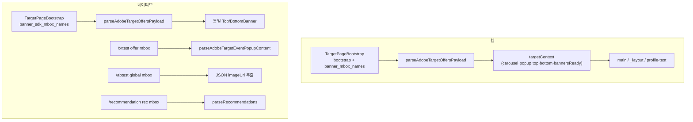

### C.2 페이지·mbox·적용 기능 매트릭스

| 오퍼 구분 | `type` (또는 계약) | 적용 UI | 노출 범위(페이지) | 트리거·mbox | 연동 경로 |
|-----------|-------------------|---------|-------------------|-------------|-----------|
| **이벤트 팝업** | `event-popup` | `EventPopup` 모달 | **웹** `/main`, `/profile-test`(Re-fetch) · **네이티브** `/xttest` | 웹: `bootstrap_mbox_name`(`target-ready-mbox`) 또는 profile-test 응답 · 네이티브: `offer_sdk_mbox_name`(`target-msdk-mbox`) | 웹 §14.4 · 네이티브 XT |
| **상단 띠배너** | `top-banner` | `TopBanner` → `StripBanner` | **웹·네이티브 전역** — `AppHeader` 아래 | 웹: `bootstrap_mbox` + **`banner_mbox_names`** 각 1 Activity 권장 · 네이티브: **`banner_sdk_mbox_names[0]`** 등 | `_layout.tsx` |
| **하단 띠배너** | `bottom-banner` | `BottomBanner` → `StripBanner` | **웹·네이티브 전역** — `AppFooter` 위 | 동일 | `_layout.tsx` |
| **캐러셀 제어** | *(없음)* `buttonText` / `autoPlayMs` | `ImageCarousel` — "다음" 버튼 문구·자동 재생(ms) | **웹** `/main` | 웹 bootstrap mbox | `main.tsx` → Context |
| **A/B 이미지** | *(없음)* `imageUrl` | `AbTestScreen` — 좌(기본) / 우(오퍼 URL) 비교 | **네이티브** `/abtest` | `global_sdk_mbox_name`(`target-global-msdk-mbox`) | 네이티브 only |
| **추천 목록** | Design JSON (`items` 등) | `RecommendationTestPanel`(웹) / `RecommendationScreen`(네이티브) | **웹** `/recommendation-test` · **네이티브** `/recommendation` | 웹: `recs_mbox_name`(`target-recs-mbox`) · 네이티브: `rec_sdk_mbox_name`(`target-rec-msdk-mbox`) | §15 · `recommendationData.ts` |

> **웹**: bootstrap 1회 Delivery에 `bootstrap_mbox_name` + `banner_mbox_names[]`를 **동시 요청**해 location 충돌을 피한다.  
> **네이티브**: `TargetPageBootstrap`이 `banner_sdk_mbox_names`를 SDK로 일괄 조회해 **동일 파서·동일 Top/BottomBanner**로 표시한다. `bannersReady` 전에는 배너를 그리지 않는다(FOUC 방지).  
> **회선 로그인** 후 `thirdPartyId=line_id`로 Audience 매칭이 바뀌면 `refreshOffers`로 배너·팝업이 갱신된다(§6.3).

### C.3 JSON 샘플 양식 (Adobe 오퍼 콘텐츠)

Activity 편집기 **Form-based Experience → JSON** 필드에 아래 형태로 넣는다. (실제 필드는 활동마다 다를 수 있음.)

#### C.3.1 `event-popup` — 이벤트 팝업

```json
{
  "type": "event-popup",
  "title": "3월 프로모션",
  "body": "지금 가입하면 월 5,000원 할인",
  "buttonText": "확인"
}
```

| 필드 | 필수 | 설명 |
|------|------|------|
| `type` | ✅ | 반드시 `"event-popup"` |
| `title` | 권장 | 모달 제목 |
| `body` | 권장 | 본문 |
| `buttonText` | 선택 | 닫기/확인 버튼 라벨(없으면 기본 문구) |

- **웹:** bootstrap 또는 profile-test Re-fetch 후 `EventPopup` 표시. 닫기 전까지 모달, `dismiss`로 숨김.
- **네이티브:** `/xttest`에서 "오퍼 가져오기" → 동일 `EventPopup` 컴포넌트.

#### C.3.2 `top-banner` / `bottom-banner` — LGU+ 스타일 띠배너

**상단 (`top-banner`)** — 기본 배경 마젠타 `#E6007E`, 흰색 텍스트:

```json
{
  "type": "top-banner",
  "title": "U+ 멤버십 혜택",
  "body": "이번 달 데이터 2배",
  "ctaText": "자세히",
  "ctaUrl": "https://example.com/promo",
  "ctaTarget": "_blank",
  "backgroundColor": "#E6007E",
  "textColor": "#FFFFFF",
  "endAt": "2026-06-30",
  "expiredTitle": "프로모션이 종료되었습니다"
}
```

**하단 (`bottom-banner`)** — 기본 밝은 배경, CTA는 마젠타 강조:

```json
{
  "type": "bottom-banner",
  "title": "앱 전용 쿠폰",
  "body": "오늘까지 사용 가능",
  "ctaText": "받기",
  "ctaUrl": "https://example.com/coupon",
  "backgroundColor": "#FFFFFF",
  "textColor": "#1A1A2E"
}
```

| 필드 | 필수 | 설명 |
|------|------|------|
| `type` | ✅ | `"top-banner"` 또는 `"bottom-banner"` |
| `title` | ✅ | 1줄 메인 문구(없으면 "상/하단 띠배너 위치" placeholder) |
| `body` | 선택 | 부제(2번째 줄, 1줄 말줄임) |
| `ctaText` | 선택 | 우측 CTA 라벨 |
| `ctaUrl` | 선택 | CTA 탭 시 URL 열기 |
| `ctaTarget` | 선택 | 웹만: `"_self"`(현재창) / `"_blank"`(새창, 기본). 네이티브는 외부 브라우저 |
| `backgroundColor` | 선택 | 띠 배경색(hex) |
| `textColor` | 선택 | 제목·본문·닫기(X) 색 |
| `endAt` | 선택 | 마감 시각(마케터 친화: `YYYY-MM-DD` 또는 `YYYY-MM-DD HH:mm`, KST 기본). 진행 중 본문에 **남은시간** 표시 |
| `expiredTitle` | 선택 | `endAt` 만료 후 제목 교체 문구 |

- 사용자가 **닫기(X)** 를 누르면 **해당 세션 동안만** 숨김(로컬 state). Target 오퍼 자체는 유지.
- **웹 전역** `_layout`: `AppHeader` → `TopBanner` → 화면 → `BottomBanner` → `AppFooter`.

#### C.3.3 캐러셀 — `buttonText` / `autoPlayMs` (`type` 없음)

메인 `/main` 이미지 캐러셀의 **"다음" 버튼 문구**와 **자동 슬라이드 간격**만 바꾼다. `type` 필드는 **넣지 않는다**.

```json
{
  "buttonText": "▶ 다음 요금제",
  "autoPlayMs": 4000
}
```

| 필드 | 필수 | 설명 |
|------|------|------|
| `buttonText` | 선택 | "다음 이미지" 버튼 라벨(기본: `▶ 다음 이미지`) |
| `autoPlayMs` | 선택 | 자동 재생 주기(ms). 양의 숫자만 유효 |

- `offers[]`에서 `event-popup` / `top-banner` / `bottom-banner`가 **아닌** 항목 중, `buttonText` 또는 `autoPlayMs`가 있는 **첫 번째** 항목을 캐러셀 오퍼로 쓴다.

#### C.3.4 A/B 이미지 — `imageUrl` (네이티브, `type` 없음)

`/abtest` 전용. **global mbox** 진입 시 1회 자동 호출. 전용 `type` 없이 **`imageUrl` 하나**만 계약:

```json
{
  "imageUrl": "https://cdn.example.com/ab/variant-b.png"
}
```

- 화면 **왼쪽**: 앱 기본 이미지(`default.png`) · **오른쪽**: 오퍼 `imageUrl`.
- 파서 없이 `JSON.parse` → `imageUrl` 문자열만 추출(`AbTestScreen`).

#### C.3.5 추천 — Design JSON (`items` / `recommendations`)

Recommendations **Design 템플릿** 출력 형태. `type` 필드 대신 **`items` 배열**(또는 `recommendations`) 구조:

```json
{
  "meta": {
    "algorithm": "Item-Based",
    "keyName": "Galaxy S24"
  },
  "items": [
    { "entityId": "42", "name": "갤럭시 버즈", "categoryId": "sb", "stCode": "01" },
    { "entityId": "38", "name": "갤럭시 케이스", "categoryId": "sf", "stCode": "02" }
  ]
}
```

- **웹** `/recommendation-test`: 백엔드가 `recommendations` 배열로 정규화해 반환 → 패널 표시.
- **네이티브** `/recommendation`: SDK content 문자열 → `parseRecommendations()` — `[items]` · `{ items }` · `{ content: { items } }` · `{ recommendations }` 등 **여러 형태 허용**. 미해결 토큰(`$entity5.id` 등)·빈 슬롯은 필터.

> Design·카탈로그·Activity 세팅은 `docs/adobe/03_RECOMMANDATION.md` 참고.

### C.4 웹 bootstrap 한 번에 여러 오퍼 받기 (예시)

`backend/env/config.adobe.json`의 **`bootstrap_mbox_name`**(기본 `target-ready-mbox`)에 Activity를 매핑하고, Experience에 **JSON 오퍼를 type별로 여러 개** 두면(또는 여러 Activity가 같은 mbox에 매칭되면) 응답 `offers[]`에 항목이 여러 개 올 수 있다.

**백엔드 응답 예 (`POST /api/target/offers`, bootstrap):**

```jsonc
{
  "mbox": "target-ready-mbox",
  "offers": [
    {
      "source": "mbox",
      "type": "json",
      "content": {
        "type": "top-banner",
        "title": "U+ 멤버십 혜택",
        "ctaText": "자세히",
        "ctaUrl": "https://example.com"
      }
    },
    {
      "source": "mbox",
      "type": "json",
      "content": {
        "type": "bottom-banner",
        "title": "앱 전용 쿠폰"
      }
    },
    {
      "source": "mbox",
      "type": "json",
      "content": {
        "type": "event-popup",
        "title": "환영합니다",
        "body": "첫 방문 고객 혜택",
        "buttonText": "확인"
      }
    },
    {
      "source": "mbox",
      "type": "json",
      "content": {
        "buttonText": "▶ 다음 요금제",
        "autoPlayMs": 5000
      }
    }
  ],
  "tntId": "…",
  "target_cookie": { "name": "mbox", "value": "…", "maxAge": 63072000 }
}
```

**앱 동작 순서 (웹):**

1. `_layout` 마운트 → `TargetPageBootstrap`이 DOM ready 후 bootstrap offers 1회 fetch.
2. `parseAdobeTargetOffersPayload` → Context에 carousel / eventPopup / topBanner / bottomBanner 저장.
3. `_layout`의 `TopBanner`·`BottomBanner`, `/main`의 `ImageCarousel`·`EventPopup`이 각각 소비.

### C.5 구현 파일 빠른 참조

| 기능 | 파서 / 유틸 | UI 컴포넌트 | 설정(mbox) |
|------|-------------|-------------|------------|
| 전체 JSON 분기 | `targetOfferParser.ts` | — | — |
| bootstrap fetch | `TargetPageBootstrap.tsx` | — | `config.adobe.json` → `bootstrap_mbox_name` |
| Context 상태 | `targetContext.tsx` | — | — |
| event-popup | `parseAdobeTargetEventPopupContent` | `EventPopup.tsx` | — |
| top/bottom 띠배너 | `_toBannerOffer` | `TopBanner` / `BottomBanner` / `StripBanner` | bootstrap |
| 캐러셀 | carousel 분기 | `targetImageCarousel.tsx` | bootstrap |
| profile-test 팝업 | `parseAdobeTargetOffersPayload` | `ProfileTestPanel` + `EventPopup` | `offer_mbox_name` |
| A/B imageUrl | `AbTestScreen` inline | `AbTestScreen.tsx` | `global_sdk_mbox_name` |
| 추천 items | `parseRecommendations` | `RecommendationScreen` / `RecommendationTestPanel` | rec mbox |

### C.6 점검·FAQ (JSON 오퍼)

| 증상 | 확인 |
|------|------|
| 팝업만 안 뜸 | content에 `"type":"event-popup"` 있는지, title/body JSON 유효한지 |
| 띠배너가 placeholder만 보임 | bootstrap mbox Activity 게시·`type` 오타(`top-banner`/`bottom-banner`) |
| 캐러셀 버튼이 안 바뀜 | 다른 type 오퍼만 있고 `buttonText`/`autoPlayMs` 없음, 또는 carousel보다 앞선 항목이 이미 carousel로 잡힘 |
| A/B 오른쪽 이미지 없음 | global mbox 오퍼 JSON에 `imageUrl`(https) 있는지, 네이티브 빌드인지 |
| 추천 JSON 파싱 빈 배열 | Design 출력 형태·`items` 키·미해결 Velocity 토큰 — §15.5 backup |

## 20. 문서 이력

| 버전 | 일자 | 요약 |
|------|------|------|
| **3.8** | 2026-06-26 | **루트 `/.easignore`**(§16) — monorepo EAS 아카이브 기준 정정(`frontend/.easignore` 무효), 서버 git pull 빌드·검증 절차, telecom API 503 FAQ·`03` §4.3 |
| **3.7** | 2026-06-26 | EAS `.easignore`(§16) — Git 제외 `config.{dev,prd}.json`을 Metro 번들·EAS 업로드에 포함, FAQ·§17·§18·`02` §6.2 동기화 *(이후 루트 위치로 정정 → 3.8)* |
| **3.6** | 2026-06-26 | **회선 로그인(§6.3)**·`telecom_db`/lines API·`banner_mbox_names`(웹 다중 mbox)·`banner_sdk_mbox_names`(네이티브 배너)·`bannersReady` FOUC·띠배너 `endAt`/`ctaTarget` — 부록 C·§17·FAQ·01~03 가이드 동기화 |
| **3.5** | 2026-06-19 | **부록 C(JSON 오퍼 타입별 적용)** 추가 — event-popup·top/bottom-banner·캐러셀·A/B imageUrl·추천 Design JSON 샘플, 페이지/mbox 매트릭스, bootstrap 다중 오퍼 예시, 구현 파일·FAQ |
| **3.4** | 2026-06-05 | **부록 B(네이티브 서버사이드/하이브리드 연동)** 추가 — 앱→백엔드(Python/Java SDK)→Delivery API 구조, [A]/[B] 비교, ECID(`marketing_cloud_visitor_id`) 스티칭·하이브리드 정의, **식별자 발급 주체(thirdPartyId=임의지정 / tntId·ECID=받아서 재사용) 원칙(B.3)**, 사용 시나리오별 권장 |
| **3.3** | 2026-06-04 | **SDK 객체 레퍼런스(§14.5)** 추가 — `@adobe/react-native-aeptarget`의 `Target`·`TargetParameters`·`TargetRequestObject`·`TargetProduct`·`TargetOrder` 역할·생성자·공식 문서 링크. 추천 전용 mbox(`target-rec-msdk-mbox`) 분리 반영(§14.2~3·§15) |
| **3.2** | 2026-06-04 | **네이티브 추천(Recommendations) 완전 가이드(§15)** 신규 — 구성요소·데이터 적재→학습→조회 흐름도·Target UI 세팅 순서·**Backup/Default 동작(§15.5)**·가드레일(250자 등)·구현 매핑. 테스트 화면 3종(§14.3 XT/A·B/추천 SDK)·`mobile_env` 설정(§14.1~2)·푸터 두 줄 반영. 섹션 번호 15~19→16~20. FAQ에 추천 항목 추가 |
| **3.1** | 2026-06-01 | **설치 확장 검증 매트릭스(§10.1)** 추가(Core·Identity·Target·Assurance ✅, Profile ⚠️ 선택). **event-popup 웹/네이티브 공용화(§14.4)** 기술. **노출/클릭 알림 미연결 범위 명시(§11).** 리팩토링 정리 반영 — 웹 mbox 백엔드 단일 소스(`bootstrap` 역할)·`_run_delivery`·`targetHttp`·요청 모델 공통 베이스(`_TargetVisitorRequest`) |
| **3.0** | 2026-06-01 | **전면 재작성(가독성·흐름 중심).** 1~4부 구성, 개념·웹·네이티브·운영 분리. **네이티브 모바일 SDK 연동(AEPCore/AEPTarget/AEPAssurance·플랫폼 분리·`adobe_mobile_app_id`·테스트 화면) 신규 기술.** 시퀀스/흐름도·예시 JSON 추가 |
| 2.3 | 2026-05-14 | `app/main.py` CORS(dev 정규식·OPTIONS·private network)·`build_delivery_id` 시그니처·`entity.categoryId` 항상 키 존재 정합 |
| 2.2 | 2026-05-13 | recommendation-test: `customerIds`·`Product`·재시도·응답 `target_location_hint_cookie`·프론트 반영 |
| 2.1 | 2026-05-13 | 연관 문서(01~03)·저장소·브리지·라우트 3개·트랙 제거 반영 |
| 2.0 | 2026-05-07 | 현행 Delivery 중심 전면 재작성 |
