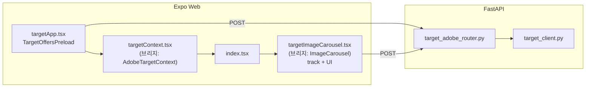

# AT_TEST_PAGE Adobe Target 연동 가이드

**문서 버전 2.9** (2026-05-08) — 갤러리 클릭 시 **`send_notifications` → `get_offers`** 순차 호출(Context `refreshOffers`). 요청 본문 **`profile_params`** → Delivery `Notification.profile_parameters`. v2.8 설정·핸들러 명명은 동일.

본 문서는 **현재 저장소에 적용된 Adobe Target 연동**만 설명한다. 제품·화면 전체는 아래 문서를 본다.

- 제품 요약: `docs/main/01_AT_TEST_PAGE_PRD.md`
- 프론트 구조: `docs/main/02_AT_TEST_PAGE_FRONTEND_GUIDE.md`
- 백엔드·API: `docs/main/03_AT_TEST_PAGE_BACKEND_GUIDE.md`

---

## 1. 문서 목적

1. 웹(Expo Web)에서 Target을 **어떻게** 호출하는지(백엔드 프록시, `fetch` 경로)를 한 번에 파악할 수 있게 한다.
2. **설정 파일**과 **주요 소스 파일**의 역할을 짧게 매핑한다.
3. 다른 프로젝트로 옮길 때 필요한 **최소 체크리스트**를 제공한다.

---

## 2. 동작 한눈에

### 2.1 흐름

1. 브라우저는 Adobe JS SDK를 쓰지 않고, **우리 FastAPI**에 `POST`한다.
2. FastAPI가 **Target Python SDK**로 Adobe Delivery API를 호출한다.
3. 오퍼 조회와 클릭 트래킹은 각각 **`/api/target/offers`**, **`/api/target/notifications`** 이다(구 경로 **`/api/target/track`** 동일 구현).

### 2.2 적용 범위

- 오퍼 프리로드·클릭 전송·오퍼 기반 UI(버튼 문구·자동 슬라이드)는 **`Platform.OS === "web"`** 일 때만 동작한다.

### 2.3 구성도

### 2.4 런타임 순서(저장소 현행)

1. **앱 기동(웹)** — `_layout.tsx`가 `TargetAppProvider`(`adobe_frontend/target_frontend/app/targetApp.tsx`)로 트리를 감싼다.
2. **오퍼 프리로드** — `TargetOffersPreload`의 `useEffect`가 한 번 `POST {api_url}/api/target/offers`를 보낸다. 본문에는 `config.adobe_target.offer_mbox_name`(출처: 로컬 `frontend/env/config.adobe.json` + `loadConfig` 병합), `page_url`(가능 시 `window.location.href`), `getAdobeTargetVisitorPayload()`(sessionStorage 기반 `tnt_id`/`visitor_id`)가 포함된다.
3. **백엔드 offers** — `asyncio.to_thread` 안에서 `TargetClient.get_offers`가 Delivery `POST /rest/v1/delivery`를 호출한다. `mbox_name`이 `target-global-mbox`이면 요청 본문은 `execute.pageLoad`(URL 필수), 그 외 이름이면 `execute.mboxes` 한 건이다. 응답 오퍼는 `_offers_from_execute_response`가 `page_load.options`와 `mboxes[].options`를 합쳐 `{ type, content }[]`로 만든다.
4. **프론트 반영** — 성공 시 `sessionStorage`에 `tnt_id` 등을 갱신하고, `parseAdobeTargetOffer` 결과를 Context에 넣는다. `index.tsx`가 `useAdobeTargetOffer()`로 읽어 `ImageCarousel`(실제 구현 `targetImageCarousel.tsx`)에 `adobeOffer`를 넘긴다.
5. **클릭 트래킹(웹)** — 갤러리 썸네일·캐러셀「다음」 등에서 `POST {api_url}/api/target/notifications`을 보낸다(구현: `targetTrack.ts`). `mbox_name`은 `config.adobe_target.notif_mbox_name`, 동일 방문자 페이로드·`clickEvent*` 등 `params`를 붙인다.
6. **백엔드 notifications** — `send_notifications`로 Delivery 요청을 보낸다. 본문에는 `execute`가 없고 `notifications[]`만 있다(아래 2.5 참고). HTTP 200과 함께 응답 `id.tnt_id` 등이 오면 다음 offers/notifications에 재사용할 수 있다.

### 2.5 Delivery 요청·응답 형태(진단 로그와 대응)

**offers(`get_offers`)** — 응답에 `execute`가 채워지고, 오퍼는 `execute.page_load.options` 또는 `execute.mboxes[].options`에 실린다.

**track(`send_notifications`)** — 요청 요약 로그 예:

- `mode=notifications`, `execute_mboxes=-`, `notification_mboxes=['target-click-mbox']`, `tntId=...`, `property_token=...`
- `request to_str` 안에 `execute: None`, `notifications: [{ type: 'click', mbox: { name: '...' }, parameters: {...}, tokens: [] }]` 가 보인다.

응답은 성공 시 `status=200`, `request_id`, `client`, `edge_host` 등이 오고 **`execute`/`prefetch`/`notifications` 필드가 비어 있는 경우가 많다.** 이는 알림 전용 응답의 정상 형태이며, “오퍼가 안 왔다”는 뜻이 아니다. (향후 `eventToken`을 `tokens`에 넣는 개선은 별 작업.)

---

## 3. 기술 스택

### 3.1 프론트

| 항목 | 내용 |
|------|------|
| 런타임 | Expo 54, React 19, RN Web |
| Target 호출 | 브라우저 `fetch` (npm용 `@adobe/*` 패키지 없음) |
| 설정 | `frontend/env/config.dev.json` / `config.prd.json` (`__DEV__`로 선택) + **`frontend/env/config.adobe.json`**(로컬, `loadConfig`에서 `adobe_target` 병합; 없으면 `postinstall`이 example에서 생성) |

### 3.2 백엔드

| 항목 | 내용 |
|------|------|
| API | FastAPI, Uvicorn |
| SDK | `target-python-sdk` → `TargetClient` |
| 요청 모델 | `delivery_api_client` (`DeliveryRequest`, `VisitorId`, `ModelProperty` 등). 스키마 필드 `property`는 코드에서 **`_property=ModelProperty(...)`** 로 넘긴다. |
| 블로킹 방지 | 동기 SDK 호출은 **`asyncio.to_thread`** 로 감싼다. |

### 3.3 의존성

`backend/requirements.txt`에 `target-python-sdk`와 SDK 전이 의존성(`six`, `urllib3`, `certifi` 등), Python 3.13 호환용 **`setuptools<70`** 이 명시되어 있다.

---

## 4. 설정

### 4.0 Git과 비밀 값

- **`backend/env/config.adobe.json`**, **`frontend/env/config.adobe.json`** 은 `.gitignore` 로 저장소에서 제외한다(자격·mbox 등).
- 템플릿은 각 디렉터리의 **`config.adobe.example.json`** 이다.
- **백엔드**: 클론 후 `cp backend/env/config.adobe.example.json backend/env/config.adobe.json` 으로 만들고 실제 값으로 채운다.
- **프론트**: `npm install` 의 `postinstall` 이 `frontend/env/config.adobe.json` 이 없을 때만 example 을 복사해 생성한다(이미 있으면 덮어쓰지 않음).

### 4.1 백엔드 Adobe 공통 `backend/env/config.adobe.json`(로컬) / 템플릿 `config.adobe.example.json`

`APP_ENV`(dev/prd)와 무관하게 한 파일에서 읽는다(`adobe_backend/target_backend/target_config.py`). dev·prd 전용 JSON과 같은 `backend/env/` 디렉터리에 둔다.

**키 배치(둘 중 하나):** (A) 루트에 `client`, `organization_id`, `property_token`, `timeout`, `offer_mbox_name`, `notif_mbox_name` 평면으로 둔다. (B) `administration` 객체에 `client`·`organization_id`·`property_token`·`timeout`, `mboxes` 객체에 `offer_mbox_name`·`notif_mbox_name` — 로더가 두 형식을 모두 읽는다(구 `track_mbox_name` 키는 백·프 로더가 폴백으로 읽음).

1. **`client`** — Target 클라이언트 코드 (ASCII만).
2. **`organization_id`** — `...@AdobeOrg` 형식 (ASCII만).
3. **`property_token`** — Property 토큰 (ASCII만).
4. **`timeout`** — SDK 타임아웃(ms).
5. **`offer_mbox_name`** — `POST /api/target/offers` 요청 본문에서 `mbox_name`을 생략할 때 쓰는 기본값(프론트 로컬 `frontend/env/config.adobe.json` 과 동일 키 권장). JSON에 없거나 trim 후 빈 문자열이면 **`target-global-mbox`** 로 폴백한다.
6. **`notif_mbox_name`** — `POST /api/target/notifications`(·레거시 `/api/target/track`)에서 `mbox_name` 생략 시 기본값. 없거나 빈 문자열이면 **`target-click-mbox`** 로 폴백한다(구 `track_mbox_name` JSON 키는 폴백 입력).

`client`·`organization_id`·`property_token` 문자열은 **trim** 되고, 비ASCII·빈 값은 SDK 초기화 시 API **400**으로 막는다. mbox 이름 두 필드는 **trim만** 적용되며, 빈 값만 위 폴백 문자열로 대체된다.

### 4.2 백엔드 앱·DB `backend/env/config.{APP_ENV}.json`

`api_port`, `cors_origins`, `db` 등 일반 설정만 둔다. **Adobe Target 자격·mbox 값은 로컬 `backend/env/config.adobe.json`에 둔다.**

`cors_origins`에 웹 앱 출처를 넣는다. `POST /api/target/*` 도 CORS를 통과해야 한다.

### 4.3 프론트 Adobe 공통 `frontend/env/config.adobe.json`(로컬) / 템플릿 `config.adobe.example.json`

1. **`offer_mbox_name`** — 오퍼 요청의 `mbox_name`.
2. **`notif_mbox_name`** — `send_notifications` 요청의 `mbox_name`.

`utils/loadConfig.ts`가 dev/prd JSON과 병합해 `config.adobe_target`으로 노출한다. JSON이 `mboxes` 안에만 mbox 키가 있어도 된다(정규화됨).

### 4.4 프론트 앱 `frontend/env/config.{dev|prd}.json`

`api_url`, `port`, `images` 등 **앱 메타만** 둔다. mbox 이름은 **로컬 `frontend/env/config.adobe.json`** 으로 이전했다.

### 4.5 mbox 이름과 백엔드 동작

1. 이름이 **`target-global-mbox`**(대소문자 무시)이면 서버는 **`pageLoad`** 로만 보낸다. Adobe는 이 이름을 `mboxes` 배열에 넣는 것을 허용하지 않는다.
2. 그 외 이름은 **`mboxes`** 한 건으로 보낸다.
3. **`page_url`** 은 글로벌 mbox·pageLoad 경로에서 주소로 쓰인다. 프론트는 가능하면 `window.location.href`를 넣는다.

---

## 5. 백엔드

### 5.1 엔드포인트

| 메서드·경로 | 설명 |
|-------------|------|
| `POST /api/target/offers` | 오퍼 조회. 본문: 선택 `mbox_name`(생략 시 `adobe_target.offer_mbox_name`), 선택 `page_url`, `tnt_id`, `visitor_id`, `params`. |
| `POST /api/target/notifications` | 클릭 알림(Delivery SDK `send_notifications`). 라우터 함수명 `send_notifications`. 본문: 선택 `mbox_name`(생략 시 `adobe_target.notif_mbox_name`), 선택 `tnt_id`, `visitor_id`, `params`. **프론트 권장 URL**(경로에 `track` 없음 — 일부 광고·프라이버시 확장이 `/track` 요청을 차단하는 경우가 있음). |
| `POST /api/target/track` | 위와 **동일 본문·동일 처리**. 레거시·curl 호환용. |

### 5.2 주요 파일

1. **`adobe_backend/target_backend/target_client.py`** — `get_target_client()` 싱글톤, 설정 ASCII 검증.
2. **`adobe_backend/target_backend/target_adobe_router.py`** — 위 두 엔드포인트, Delivery 요청 조립, `VisitorId` 생성·응답 `tnt_id` 반환.
3. **`adobe_backend/target_backend/target_config.py`** — 로컬 `backend/env/config.adobe.json` 로드(템플릿 `config.adobe.example.json`), `AdobeTargetSettings`.
4. **`adobe_backend/target_backend/target_main.py`** — `register_target_routes(app)`.
5. **`app/config.py`** — DB·raw 로드 후 `load_adobe_target_settings()`로 `Settings.adobe_target` 결합.
6. **`app/main.py`** — `target_main.register_target_routes(app)`, CORS에 `POST` 허용.

### 5.3 방문자 ID

1. Adobe는 **`tnt_id` / `third_party_id` / `marketing_cloud_visitor_id`** 중 하나는 있어야 한다. SDK가 자동으로 채워주지 않는다.
2. 요청에 `tnt_id`·`visitor_id`가 없으면 서버가 **`{uuid}.28_0`** 형식의 임시 `tnt_id`를 만든다.
3. 응답에 정식 `tnt_id`가 오면 다음 요청에 **그대로 재사용**하는 것이 좋다.

### 5.4 HTTP 오류

1. 설정 문제·URL 파싱 실패·Adobe 400 → **400**, 본문은 문자열 `detail` 위주.
2. 그 외 SDK/Adobe 오류 → **502**, `detail`에 `code`, `reason`, `message` 등 객체 형태가 올 수 있다.
3. 배포 URL 파싱 오류 후 설정을 고친 경우, 라우터가 **설정·클라이언트 캐시를 비우는** 경로가 있다.

### 5.5 진단 로그 (선택)

서버 환경변수 **`AT_DEBUG_DELIVERY=1`** 이면 다음을 분할 로깅한다. **운영 기본값은 끈다.**

1. **공통** — 요청 `request summary` 한 줄, `DeliveryRequest.to_str()`, 응답 `repr(response.to_dict())` 분할.
2. **get_offers만** — 응답 `execute`(pageLoad 옵션 수·mboxes 이름·옵션 미리보기), `prefetch` 존재 여부. `execute`가 비면 “오퍼 미매칭 가능”으로 해석할 수 있다.
3. **`send_notifications` 디버그 라벨만** — SDK `send_notifications` 응답은 `execute`가 비는 것이 정상이므로, **execute/prefetch 상세 분기는 생략**하고 한 줄로 “분기 생략”만 남긴다(오해 로그 방지). 첫 줄에 `edge_host`도 함께 찍는다.

### 5.6 개발 시 주의

`delivery_api_client`의 **`ApiClient()` / `Configuration()` 을 인자 없이 만들지 않는다.** (호스트가 잘못 고정되는 문제가 있다.) 요청/응답 직렬화는 **`DeliveryRequest` 인스턴스의 `to_str()` / 응답 객체의 `to_dict()`** 만 사용한다. 상세는 `target_adobe_router.py` 상단 주석.

---

## 6. 프론트엔드

### 6.1 데이터 흐름

1. **`_layout.tsx`** — `TargetAppProvider`·`TargetOffersPreload`(`adobe_frontend/target_frontend/app/targetApp.tsx`)를 트리에 둔다.
2. **`targetContext.tsx`** — Provider, `useAdobeTargetOffer`, `useAdobeTargetSetOffer`, 오퍼 JSON 파싱. 기존 경로는 `context/AdobeTargetContext.tsx` 브리지 재노출.
3. **`index.tsx`** — `useAdobeTargetOffer()`로 읽어 **`ImageCarousel`** 에 `adobeOffer` prop 전달(구현은 `targetImageCarousel.tsx`).
4. **`targetImageCarousel.tsx`** · **`ImageGallery.tsx`** — 오퍼로 버튼 문구·`autoPlayMs` 적용; 웹에서만 `targetTrack.ts`의 `sendAdobeTargetTrack`으로 `POST .../notifications`. **`getAdobeTargetVisitorPayload()`** 로 offers와 같은 방문자 ID를 붙인다.
5. **`targetSession.ts`** — `sessionStorage` 키와 `tnt_id` 우선·`visitor_id` 보조 페이로드. 기존 경로는 `utils/adobeTargetSession.ts` 브리지.

### 6.2 UI 관련 (Target 비호출)

웹에서 RN `shadow*` 경고를 줄이기 위해 **`ImageGallery`**, **`CouponTable`** 카드에 웹만 `boxShadow` 분기가 있다. Target API와는 무관하다.

---

## 7. HTTP 요약 (프록시 기준)

### 7.1 `POST /api/target/offers`

**요청 (JSON)**

- `mbox_name` (선택·생략 시 로컬 `backend/env/config.adobe.json` 의 `offer_mbox_name` → `get_settings().adobe_target.offer_mbox_name`, 없으면 `target-global-mbox`)
- `page_url`, `tnt_id`, `visitor_id`, `params` (선택)

**응답 (JSON)**

- `offers`: `{ type, content }[]` — pageLoad·mboxes 양쪽 옵션을 합친 결과.
- `mbox`, 선택 `tnt_id`, `visitor_third_party_id`.

### 7.2 `POST /api/target/notifications` (레거시: `POST /api/target/track`)

**요청 (JSON)**

- `mbox_name` (선택·생략 시 `adobe_target.notif_mbox_name`, 없으면 `target-click-mbox`)
- `tnt_id`, `visitor_id`, `params` (선택·`params`는 객체)
- `profile_params` (선택·객체) — SDK `Notification.profile_parameters`. 프로필 반영 직후 프론트에서 `POST /api/target/offers` 를 이어 호출하면 Audience 판단에 반영될 수 있다(구현: `refreshOffers`).

**응답 (JSON)**

- `status`, `mbox`, 선택 `tnt_id`, `visitor_third_party_id`.

---

## 8. 클릭 알림(Delivery) 필드 — 용도만

백엔드가 `send_notifications`에 실을 때 자주 쓰는 필드 의미다. 값 예시는 형식 설명용이다.

### 8.1 요청 쪽

| 구분 | 용도 |
|------|------|
| `_property.token` | 어느 Property(워크스페이스)에서 온 요청인지. Activity 범위와 연결된다. |
| `context.channel` | `web` 등 채널. 리포트 구분에 쓰인다. |
| `id.tnt_id` 등 | 방문자 ID. 접미사는 엣지/프로필 라우팅 힌트로 이해하면 된다. |
| `notifications[].mbox.name` | 리포트에 쓸 mbox 이름. Activity Goal과 맞춰야 한다. |
| `notifications[].type` | 예: 클릭. |
| `notifications[].timestamp` | 클릭 시각(ms). |
| `notifications[].parameters` | 자유 차원(예: 어떤 버튼인지). |
| `notifications[].tokens` | 오퍼에 붙은 **`eventToken`** 등을 넣으면 “어떤 경험을 본 뒤 클릭”이 정확해진다. **지금은 빈 배열**이라 Experience 단위 컨버전은 약할 수 있다. |

### 8.2 응답 쪽

| 구분 | 용도 |
|------|------|
| `status` | 성공 여부. |
| `request_id` | Adobe 측 추적 ID. |
| `id.tnt_id` | 세션 유지 확인·다음 요청에 재사용. |
| `execute` / `prefetch` / `notifications` | 알림 전용 호출이면 비어 있는 경우가 많다. 정상 범위일 수 있다. |

### 8.3 개선 시 `tokens`

1. `get_offers` 응답에서 토큰을 파싱한다.
2. 세션 또는 API로 트랙 요청에 넘긴다.
3. `Notification.tokens`에 채운다.

---

## 9. 이식·점검 체크리스트

1. 백엔드에 `target-python-sdk` 및 `requirements.txt` 정합.
2. 백엔드 **로컬 `backend/env/config.adobe.json`** — `client`·`organization_id`·`property_token`·`timeout`(ASCII 검증) + `offer_mbox_name`·`notif_mbox_name`; `backend/env` 에는 `cors_origins`·`db` 등만.
3. FastAPI에서 Target 라우터 등록(`target_main.register_target_routes`)·CORS `POST` 허용.
4. 동기 SDK는 **`asyncio.to_thread`** 로 호출.
5. 프론트는 **`api_url`** 로 백엔드만 호출 (`/api/target/...`).
6. **`offer_mbox_name` / `notif_mbox_name`** 을 프론트 `frontend/env/config.adobe.json`(로컬) 과 백엔드 `backend/env/config.adobe.json`(로컬) 에 동일 키로 두면, 프론트 생략·curl 단독 호출 시에도 기본 mbox가 일치한다.
7. 오퍼는 **`TargetOffersPreload` + Context** 한 번 fetch 후 하위로 전달한다.
8. offers·notifications(클릭) 모두 **`tnt_id` / `visitor_id`** 를 맞춘다 (`targetSession` + `sessionStorage`).
9. 글로벌 mbox는 서버가 **pageLoad**로만내도록 유지한다.
10. 컨버전을 빡세게 잡으려면 **`eventToken` → `tokens`** 파이프를 추가한다.
11. 장애 시에만 서버에 **`AT_DEBUG_DELIVERY=1`** 을 잠깐 켠다.

---

## 10. 연관 문서

| 문서 | 용도 |
|------|------|
| `01_AT_TEST_PAGE_PRD.md` | 제품 범위·수용 기준 |
| `02_AT_TEST_PAGE_FRONTEND_GUIDE.md` | 프론트 디렉터리·화면 |
| `03_AT_TEST_PAGE_BACKEND_GUIDE.md` | 쿠폰 API·실행 방법 |
| `docs/log/log.md` | 변경 이력·작업 로그 |

---

## 11. 문서 이력

| 버전 | 일자 | 요약 |
|------|------|------|
| 2.9 | 2026-05-08 | `profile_params`·갤러리 클릭 후 `refreshOffers`(notification→offers 순서)·`targetOffersFetch` 공통 |
| 2.8 | 2026-05-08 | `notif_mbox_name`·`target-click-mbox`·라우터 `send_notifications` / `send_notifications_legacy`·구 키 폴백 |
| 2.7 | 2026-05-08 | 클릭 프록시 권장 경로 `POST /api/target/notifications`·레거시 `/track` 병행·프론트 `targetTrack.ts` 정합 |
| 2.6 | 2026-05-08 | `config.adobe.json` Git 제외·`config.adobe.example.json` 템플릿·프론트 `postinstall` 복사 |
| 2.5 | 2026-05-07 | `config.adobe.json` administration/mboxes 중첩 로드(target_config·loadConfig 정규화) |
| 2.4 | 2026-05-07 | Adobe 공통 JSON을 `backend/env`·`frontend/env` 의 `config.adobe.json` 으로 이동 |
| 2.3 | 2026-05-07 | Adobe 패키지 통합(`adobe_backend/target_backend`, `adobe_frontend/target_frontend`), 공통 `config.adobe.json`, 레거시 경로 브리지·`@adobe/*` 별칭 |
| 2.2 | 2026-05-07 | §4.1 백엔드 `offer_mbox_name`·`track_mbox_name`·폴백. §5.1 `mbox_name` 선택. 라우터 Pydantic 기본값은 `get_settings()` |
| 2.1 | 2026-05-07 | 2.4 런타임 순서·2.5 offers/track Delivery 형태(진단 로그 대응) 추가. 5.5 track 응답에서 execute 분기 생략 설명 |
| 2.0 | 2026-05-07 | 현행 시스템 중심으로 전면 재작성. 히스토리·로그 대응표·배너 규칙 장문 제거, 01~03 형식에 맞춤 가독성 개선 |
