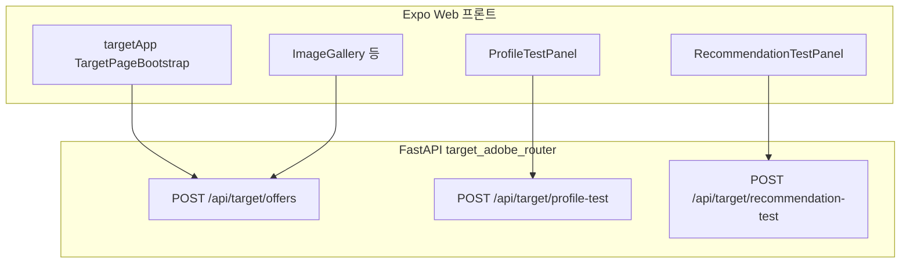

# AT_TEST_PAGE Adobe Target 연동 가이드

본 문서는 이 저장소에 **현재 적용된** Adobe Target Delivery 연동만 설명한다. 일반 FastAPI 앱 설정·쿠폰 CRUD·PostgreSQL 스키마는 별도 범위다.

### 연관 문서 (`docs/main`)

1. `01_AT_TEST_PAGE_PRD.md` — 제품 범위·수용 기준  
2. `02_AT_TEST_PAGE_FRONTEND_GUIDE.md` — 앱 라우트·컴포넌트(쿠폰 등)  
3. `03_AT_TEST_PAGE_BACKEND_GUIDE.md` — 쿠폰 API·실행 방법  

---

## 0. 용어: Delivery JSON vs Python SDK

| 구분 | 이름 | 설명 |
|------|------|------|
| HTTP JSON 방문자 객체 키 | `id` | Adobe Delivery 명세의 식별자 블록 |
| 그 안의 필드 | `tntId`, `thirdPartyId`, … | REST 본문에서 쓰는 공식 키(camelCase). 레거시로 `tnt_id` / `third_party_id` **수신**도 지원 |
| Python SDK 타입 | **`VisitorId`** | OpenAPI 제너레이터가 `id` 스키마에 붙인 클래스명. `from delivery_api_client import VisitorId` 후 `DeliveryRequest(..., id=VisitorId(tnt_id=..., third_party_id=...))` 형태로 사용 |
| 프록시 JSON(우리 FastAPI) | `tntId`, `thirdPartyId` | 응답·요청 편의 키 |

정리: `import VisitorId`는 “JSON 키가 VisitorId”가 아니라, **`id` 객체의 Python 타입**이다. 실제 전송 JSON은 항상 Delivery 명세의 `id` / `tntId` / `thirdPartyId`를 따른다.

---

## 1. 방문자 식별 정책

- **`tntId`**: 세션 연속성. 없으면 Adobe가 생성하고, 응답의 값을 다음 호출에 실어 보낸다.
- **`thirdPartyId`**: 로그인 없이 웹에서 한 번 만든 UUID를 `sessionStorage`에 고정해 매 요청에 동일하게 보낸다(offers·profile-test). 추천 테스트는 UI의 **`recipient_id`**를 `thirdPartyId`로 쓰고, 비어 있으면 서버가 UUID를 채운다. 값이 있으면 서버가 추가로 **`customerIds`**(`integration_code`: **`recipient_id`**)를 Delivery `id`에 붙인다.
- **`target_cookie` / `target_location_hint` / `session_id`**: SDK `get_offers` 옵션. 응답 쿠키 dict의 **`value` 문자열**만 다음 요청에 재전달한다. 추천 엔드포인트는 현재 구현에서 `session_id` 옵션에 `None`을 넘긴다.

---

## 2. 저장소·브리지·경로

### 2.1 백엔드

1. Target 전용 코드는 **`backend/adobe_backend/target_backend/`** 아래에 둔다.  
2. **`app/main.py`** 에서만 `register_target_routes(app)` 을 호출해 `POST /api/target/*` 를 마운트한다(쿠폰 라우터와 분리).

### 2.2 프론트엔드

1. Target UI·fetch·Context 구현은 **`frontend/adobe_frontend/target_frontend/`** 에 둔다.  
2. **`frontend/tsconfig.json`** 의 `paths` 로 **`@adobe/*`** → 위 폴더로 매핑한다(예: `@adobe/app/targetApp`, `@adobe/components/ProfileTestPanel`).  
3. 앱 루트는 **`@/components/ImageCarousel`** 등 기존 경로를 유지하기 위해 **브리지 파일**만 둔다.

| 브리지(`frontend/…`) | 실제 구현 |
|----------------------|-----------|
| `components/ImageCarousel.tsx` | `adobe_frontend/.../targetImageCarousel.tsx` |
| `components/EventPopup.tsx` | `adobe_frontend/.../EventPopup.tsx` |
| `context/AdobeTargetContext.tsx` | `adobe_frontend/.../context/targetContext.tsx` |

### 2.3 설정 파일

1. **`backend/env/config.adobe.json`** — Git 제외(자격). **`backend/env/config.adobe.example.json`** 을 복사해 채운다.  
2. **`backend/env/config.{dev|prd}.json`** — `cors_origins` 등 앱 공통 설정(쿠폰 API와 공유).

---

## 3. 동작 한눈에 보기

1. 브라우저는 Adobe JS SDK 없이 **FastAPI**로만 Target을 호출한다.  
2. FastAPI가 **Target Python SDK** `TargetClient.get_offers`로 Adobe `POST /rest/v1/delivery`를 호출한다.  
3. 메인 웹: `TargetPageBootstrap`이 DOM 준비 후 **bootstrap mbox**로 **`POST /api/target/offers`** 한 번(첫 로드), 이후 **`ImageGallery`** 등에서 `refreshOffers()`가 동일 엔드포인트에 **bootstrap mbox**를 강제(`force`)로 다시 호출한다.  
4. **클릭 전용 `POST /api/target/track` 는 현재 라우터에 없다.** 캐러셀은 오퍼 기반 UI만 적용한다.  
5. 프로필·추천 검증 화면은 각각 **`POST /api/target/profile-test`**, **`POST /api/target/recommendation-test`** 를 사용한다.

---

## 4. 기술 스택

| 영역 | 내용 |
|------|------|
| 프론트 | Expo, `fetch`, `frontend/utils/loadConfig.ts`는 앱 env JSON(`adobe_mboxes`의 offer/bootstrap mbox 문자열 포함) |
| 백엔드 | FastAPI, `target-python-sdk`, `delivery_api_client` |
| 블로킹 방지 | 동기 SDK 호출은 **`asyncio.to_thread`** |

---

## 5. 설정

- **`backend/env/config.adobe.json`**: Git 제외. **`backend/env/config.adobe.example.json`** 을 복사해 채운다. `mboxes.offer_mbox_name`·**`mboxes.recs_mbox_name`**(Recommendations Location; 생략 시 기본 `target-recs-mbox`)·**`mboxes.bootstrap_mbox_name`**(웹 첫 로드 전용; 생략 시 기본 `target-ready-mbox`) 포함.
- **`target_config.py`**: 위 파일만 읽어 `client`, `organization_id`, `property_token`, `timeout`, **`offer_mbox_name`**, **`recs_mbox_name`**, **`bootstrap_mbox_name`** 등을 로드. ASCII·빈 값 검증 실패 시 `AdobeTargetConfigError` → HTTP 400.
- **`backend/env/config.{dev|prd}.json`**: `cors_origins`에 웹 앱 출처를 넣어 `POST /api/target/*`가 CORS 통과하도록 한다. 실제 적용은 **`app/main.py`**: `GET`/`POST`/`OPTIONS`, **`allow_private_network`**, dev일 때 localhost·127.0.0.1·`[::1]` 임의 포트 **정규식** 보조(상세는 `03` §3.4).

---

## 6. 백엔드: 라우터 한 파일·세 구역

**파일:** `backend/adobe_backend/target_backend/target_adobe_router.py`  
**마운트:** `target_main.register_target_routes(app)` → 라우터 `prefix=/api`.

### 6.1 공통

- `build_delivery_id(tnt_id, third_party_id, customer_ids=None)` → SDK `VisitorId`(추천 테스트에서만 `customer_ids` 전달).
- `MboxRequest` + `DeliveryRequest` + `ExecuteRequest(mboxes=[...])` + `Context(channel=WEB)` + `ModelProperty(token=property_token)`.
- `client.get_offers({"request": request, **sdk_opts})` — `sdk_opts`는 쿠키·hint·(offers/profile만) `session_id`.
- 응답 가공: `offers_from_execute`, `_id_and_cookies`, 예외는 `_handle_error`.

### 6.2 `POST /api/target/offers`

- **본문(`OffersRequest`)**: `mbox_name`(클라이언트가 지정; 생략 시 서버 기본 `offer_mbox_name`), `page_url`(수신만 하고 아래 `DeliveryRequest`·`Context`에는 미연결), `tntId`/`tnt_id`, `thirdPartyId`/`third_party_id`, `target_cookie`, `target_location_hint`, `session_id`, **`params`** → mbox **`parameters`**.
- **응답**: `mbox`, `offers`(문자열 content 그대로일 수 있음), `tntId`, 쿠키 필드 등.

### 6.3 `POST /api/target/profile-test`

- **본문(`ProfileTestRequest`)**: offers와 동일한 식별·쿠키·`session_id` 필드 + **`profile_params`** (dict). **`mbox_name`** 기본은 offers와 동일(`offer_mbox_name`) — Audience·Profile Script를 offers와 같은 mbox 컨텍스트에서 평가하기 위함.
- **Delivery**: `MboxRequest`에 **`profile_parameters`** 로 실음(`parameters` 아님).
- **응답**: `mbox`, `status`, `request_id`, **`offers`**(`offers_from_execute(..., parse_json=True)`), **`response_tokens`** 요약, id·쿠키.

### 6.4 `POST /api/target/recommendation-test`

- **본문(`RecommendationTestRequest`)**: **`entity_id`**(필수), `entity_category_id`, **`recipient_id`**, **`price`**(선택, 기본 1000), `tntId`, `target_cookie`, `target_location_hint`. **`session_id` 없음.**
- **`recipient_id` / `thirdPartyId` / `customerIds`**: `recipient_id`가 비어 있지 않으면 그 문자열을 **`thirdPartyId`**로 쓰고, Delivery `id`에 **`CustomerId`(integration_code `recipient_id`)** 목록을 붙인다. 비어 있으면 서버가 **`thirdPartyId`만 UUID**로 채우고 `customerIds`는 생략한다.
- **재시도**: `customerIds` 경로로 `get_offers`가 실패하면 로그 후 **`customerIds` 없이** 동일 요청을 한 번 더 시도한다.
- **mbox 이름**: **`get_adobe_target_settings().recs_mbox_name`** (`mboxes.recs_mbox_name`) — Adobe Recommendations Activity Location과 동일해야 한다.
- **Delivery `MboxRequest`**: **`parameters`**(`entity.id`, `entity.categoryId` — 카테고리가 없거나 **`ss`(매장)** 이면 `categoryId`는 빈 문자열), **`product`**: `Product(id=entity_id, category_id=cat_for_entity)`, **`order`**: `Order(id=ord_{12hex}, total=price, purchased_product_ids=[entity_id])`.
- **응답**: `mbox`, `status`, `request_id`, `offers`(파싱), **`recommendations`**(오퍼 `content`가 list/dict일 때 펼침), `response_tokens`는 빈 배열, **`_id_and_cookies`**로 `tntId`, `thirdPartyId`, **`target_cookie`**, **`target_location_hint_cookie`**(객체 그대로) 포함.

### 6.5 기타 파일

| 파일 | 역할 |
|------|------|
| `target_main.py` | `register_target_routes` |
| `target_client.py` | `TargetClient` 싱글톤 |
| `target_delivery_utils.py` | `VisitorId` 조립, `offers_from_execute`(응답에 pageLoad·mboxes 옵션 모두 스캔) |
| `target_debug_utils.py` | `AT_DEBUG_DELIVERY=1` 로깅 |

---

## 7. 프론트엔드: 파일과 책임

| 경로 | 역할 |
|------|------|
| `app/_layout.tsx` | `TargetAppProvider`, `TargetPageBootstrap`, `Stack`, **`AppFooter`** |
| `components/AppFooter.tsx` | `/`, `/profile-test`, `/recommendation-test` 하단 이동 |
| `app/index.tsx` | Context 소비, `EventPopup`(브리지) |
| `app/profile-test.tsx` | `@adobe/components/ProfileTestPanel` |
| `app/recommendation-test.tsx` | `@adobe/components/RecommendationTestPanel` |
| `adobe_frontend/.../app/targetApp.tsx` | `TargetAppProvider` |
| `adobe_frontend/.../app/TargetPageBootstrap.tsx` | 웹 첫 로드: bootstrap mbox offers → Context |
| `adobe_frontend/.../components/targetImageCarousel.tsx` | 메인 캐러셀 + 오퍼 UI(트랙 API 호출 없음) |
| `adobe_frontend/.../context/targetContext.tsx` | 오퍼·event-popup, `refreshOffers` |
| `adobe_frontend/.../utils/targetOffersFetch.ts` | `POST /api/target/offers` — `mbox_name`·params 본문, mbox별 dedupe |
| `adobe_frontend/.../utils/targetProfileTest.ts` | `POST /api/target/profile-test` |
| `adobe_frontend/.../utils/targetRecommendationTest.ts` | `POST /api/target/recommendation-test` — `entity_category_id`는 **`ss`가 아닐 때만** 본문에 실음, `price` 기본 1000, 실패 시 `detail` 문자열·객체에서 메시지 추출, 응답의 **`target_location_hint_cookie`** `value`를 `AT_RECS_*`에 저장 |
| `adobe_frontend/.../utils/targetSession.ts` | `AT_*`(공통), **`AT_RECS_*`**(추천 테스트 전용 키) |
| `adobe_frontend/.../utils/targetOfferParser.ts` | `parseAdobeTargetOffersPayload` — `type: event-popup` 추출 |
| `adobe_frontend/.../components/ProfileTestPanel.tsx` | 프로필 테스트 UI + **`EventPopup`** |
| `adobe_frontend/.../components/RecommendationTestPanel.tsx` | 추천 테스트 UI |
| `adobe_frontend/.../components/EventPopup.tsx` | `title` / `body` / `buttonText` 모달 |

**`event-popup` JSON 오퍼 예:** `type`, `title`, `body`, `buttonText`. 메인은 Context 경유, 프로필 테스트는 Re-fetch 후 파서로 감지해 동일 컴포넌트로 표시한다.

---

## 8. HTTP 계약 요약

### 8.1 공통(세 엔드포인트)

- 요청·응답의 `tntId` / `thirdPartyId`(또는 snake_case) 및 `target_cookie` / `target_location_hint` 순환 원칙은 동일하다.
- SDK 옵션 `target_cookie`에는 **문자열 값**만 넣는다.

### 8.2 offers 전용

- **`params`** → mbox `parameters`(클릭 쿠키·Audience 조건 등).

### 8.3 profile-test 전용

- **`profile_params`** → mbox `profile_parameters`(프로필 속성 저장·스크립트 입력).

### 8.4 recommendation-test 전용

- **`entity_id`**, **`entity_category_id`**, **`recipient_id`**, **`price`**(기본 1000). 프론트는 `ss`이거나 비어 있으면 **`entity_category_id` 키를 생략**할 수 있다. 서버 mbox **`parameters`에는 항상 `entity.categoryId`가 포함**되며, 없거나 **`ss`**이면 **빈 문자열**이다. 서버는 매 요청마다 `Order.id`를 `ord_` + 12자 hex 로 생성한다.
- 응답 쿠키 키 이름은 SDK 그대로 **`target_location_hint_cookie`** 이다(요청 옵션명 `target_location_hint`와 다름). 프론트는 이 객체의 **`value`**만 `sessionStorage`에 넣는다.
- Adobe Activity·디자인·카탈로그가 갖춰지지 않으면 `recommendations`가 비어 있을 수 있다.

---

## 9. 이식·점검 체크리스트

1. `backend/requirements.txt` 및 venv에 호환 `setuptools` 버전.  
2. **`backend/env/config.adobe.example.json`** 을 복사해 **`config.adobe.json`** 을 만들고, `administration`·`mboxes` 블록을 채운다(ASCII).  
3. `register_target_routes(app)` 및 CORS: **`POST`**·**`OPTIONS`**, 필요 시 **`allow_private_network`**, dev에서 localhost 출처 **정규식**(백엔드 `app/main.py` 참고).  
4. 동기 SDK는 **`asyncio.to_thread`** 유지.  
5. 프론트 `fetch` 베이스 URL은 **`api_url` 또는 `api_base_url`** (`frontend/env`).  
6. 메인·프로필: **`tntId` + `thirdPartyId`** 및 쿠키·`session_id` 일관성.  
7. 추천: Activity Location 문자열이 **`mboxes.recs_mbox_name`** 설정과 일치하는지.  
8. 장애 시에만 **`AT_DEBUG_DELIVERY=1`**.  
9. Expo **`@adobe/*`** 경로가 `tsconfig.json` 과 일치하는지 확인한다.

---

## 10. 문서 이력

| 버전 | 일자 | 요약 |
|------|------|------|
| 2.3 | 2026-05-14 | §5·§6.1·§8.4·§9: `app/main.py` CORS(dev 정규식·OPTIONS·private network)·`build_delivery_id` 시그니처·`entity.categoryId` 항상 키 존재(빈 문자열) 정합 |
| 2.2 | 2026-05-13 | recommendation-test: `customerIds`·`Product`·재시도·`build_delivery_id` 확장, 응답 `target_location_hint_cookie`, 프론트 페이로드·에러·세션 갱신 반영 |
| 2.1 | 2026-05-13 | 연관 문서(01~03)·§2 저장소·브리지·`config.adobe.example`·라우트 3개·트랙 제거·프로필·추천 라우트·`targetImageCarousel` 반영 |
| 2.0 | 2026-05-07 | 현행 Delivery 중심으로 전면 재작성(v2.0 누적본과 합류) |
