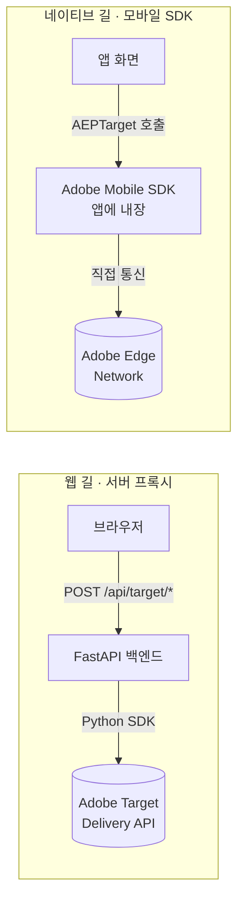
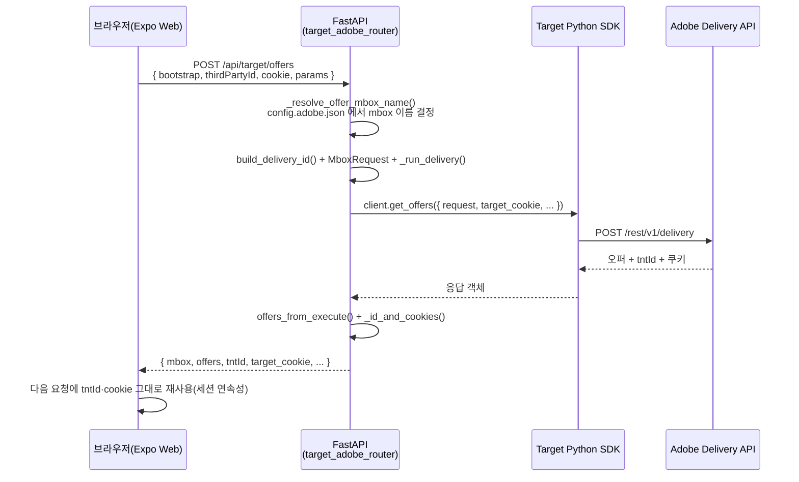
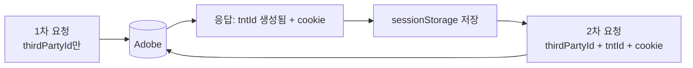
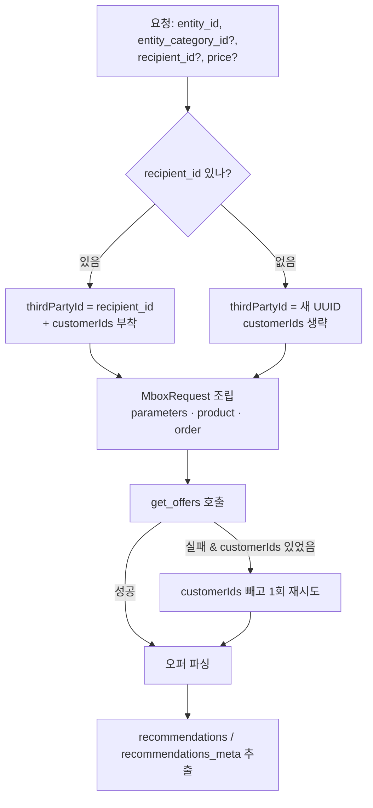
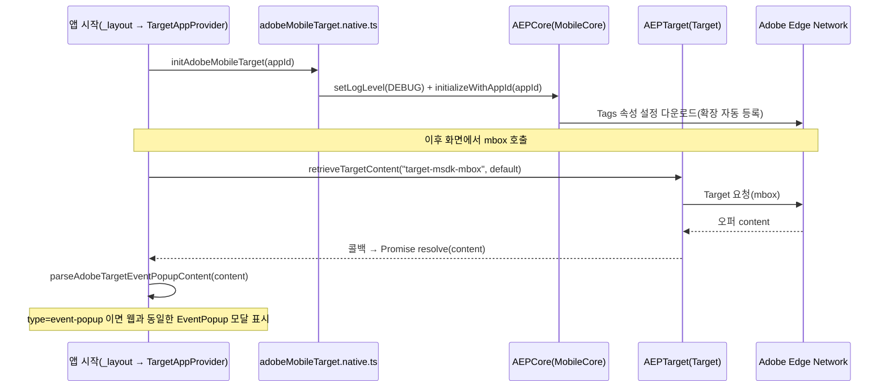
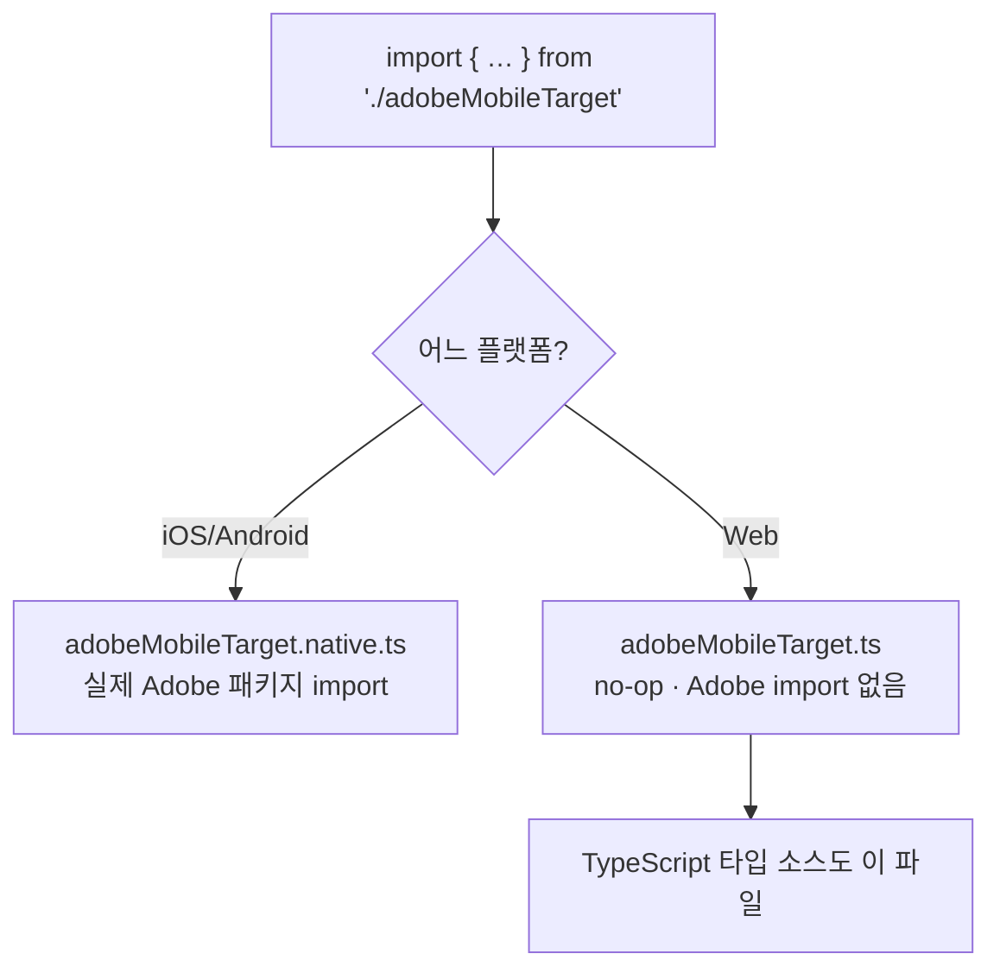
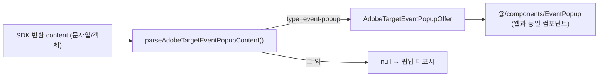

# AT_TEST_PAGE Adobe Target 연동 가이드

이 문서는 본 저장소에 **실제로 적용된** Adobe Target 연동을, 처음 보는 사람도 위에서 아래로 읽으면 이해되도록 정리한 것이다.

이 프로젝트에는 Target을 부르는 길이 **두 가지**다.

- **웹(서버 프록시) 길** — 브라우저는 Adobe를 직접 부르지 않고, 우리 **FastAPI 백엔드**가 Adobe **Target Python SDK**로 대신 호출한다.
- **네이티브(모바일 SDK) 길** — Android/iOS 앱은 **Adobe Mobile SDK**를 앱에 심어 Adobe를 **직접** 호출한다.

> 일반 FastAPI 앱 설정·쿠폰 CRUD·PostgreSQL 스키마는 이 문서의 범위가 아니다.

### 연관 문서 (`docs/main`)

1. `01_AT_TEST_PAGE_PRD.md` — 제품 범위·수용 기준
2. `02_AT_TEST_PAGE_FRONTEND_GUIDE.md` — 앱 라우트·컴포넌트(쿠폰 등)
3. `03_AT_TEST_PAGE_BACKEND_GUIDE.md` — 쿠폰 API·실행 방법

### 이 문서를 읽는 순서

```text
1부. 개념        — Target이 뭔지, 용어 5개, 두 길의 차이
2부. 웹 길        — 흐름 → 식별 정책 → 백엔드 알고리즘 → 프론트 → HTTP 예시
3부. 네이티브 길  — 흐름 → 왜 분리하나 → 패키지/설정 → 코드 → 빌드
4부. 운영        — 설정 총정리 → 체크리스트 → 문제 해결 → 이력
```

---

# 1부. 먼저 알아야 할 개념

## 1. Adobe Target 핵심 용어 5개

| 용어 | 한 줄 설명 | 비유 |
|------|------------|------|
| **mbox** | 콘텐츠를 받아올 "위치 이름". 요청할 때 이 이름으로 무엇을 받을지 지정한다. | TV의 "채널 번호" |
| **offer(오퍼)** | mbox로 돌아오는 실제 콘텐츠(텍스트·JSON 등). | 그 채널에서 나오는 "방송 내용" |
| **Activity(액티비티)** | "이 mbox에는 이런 조건일 때 이 오퍼를 줘라"라는 Adobe 쪽 규칙. | 편성표 |
| **Audience / Profile** | 방문자를 분류하는 조건(나이·등급 등)과 그 방문자에 대해 Adobe가 저장하는 속성. | 시청자 등급·취향 메모 |
| **방문자 ID** | 같은 사람을 계속 알아보기 위한 식별자. `tntId`, `thirdPartyId` 두 종류를 쓴다(§5). | 회원증 번호 |

> 핵심 한 줄: **"mbox 이름으로 요청 → Adobe가 Activity 규칙을 평가 → 오퍼를 응답"**. 우리 코드는 이 요청/응답을 웹은 백엔드가, 네이티브는 앱이 직접 수행한다.

## 2. 두 가지 연동 방식 비교



| 구분 | 웹(서버 프록시) | 네이티브(모바일 SDK) |
|------|------------------|----------------------|
| Adobe를 누가 부르나 | **FastAPI 백엔드** | **앱 자신** |
| 사용 SDK | `target-python-sdk`(서버) | `@adobe/react-native-aep*`(앱) |
| 설정값 출처 | `backend/env/config.adobe.json` | Data Collection **Tags 속성**의 Environment File ID(`appId`) |
| 브라우저/앱이 Adobe와 직접 통신? | ❌ 안 함(백엔드가 대신) | ✅ 함 |
| 적용 플랫폼 | 웹 | Android / iOS |
| 코드 위치 | `backend/adobe_backend/target_backend/` + `frontend/adobe_frontend/.../utils/*` | `frontend/adobe_frontend/.../native/*` |

> 두 길은 **서로 독립**이다. 네이티브 SDK를 추가해도 웹 동작은 전혀 바뀌지 않는다(분리 방법은 §13).

---

# 2부. 웹(서버 프록시) 연동

## 3. 웹 연동 전체 흐름

브라우저에는 Adobe JS SDK가 없다. 모든 Target 호출은 백엔드를 거친다.



세 가지 화면(엔드포인트)이 같은 패턴을 공유한다.

| 화면 | 엔드포인트 | 목적 |
|------|------------|------|
| 메인/갤러리 | `POST /api/target/offers` | mbox 오퍼 받아 UI에 반영 |
| 프로필 테스트 | `POST /api/target/profile-test` | 프로필 속성 저장·스크립트 검증 |
| 추천 테스트 | `POST /api/target/recommendation-test` | Recommendations 오퍼 검증 |

## 4. 방문자 식별 정책 (가장 중요한 규칙)

Adobe가 "같은 사람"으로 인식하게 하려면 매 요청에 식별자를 **일관되게** 실어 보내고, 응답으로 받은 값을 **다음 요청에 되돌려** 보내야 한다.



| 식별자/값 | 누가 만드나 | 순환 방식 |
|-----------|-------------|-----------|
| **`tntId`** | 비어 있으면 **Adobe가 생성** | 응답의 `tntId`를 다음 요청에 그대로 실어 세션 연속성 유지 |
| **`thirdPartyId`** | 웹이 UUID를 1회 만들어 `sessionStorage`에 고정(offers·profile) | 매 요청 동일 값 전송. 추천 테스트는 UI의 **`recipient_id`**를 사용하고, 비면 서버가 UUID 생성 |
| **`customerIds`** | 추천 테스트에서 `recipient_id`가 있을 때만 | Delivery `id`에 `integration_code="recipient_id"`로 부착 |
| **`target_cookie`** | Adobe 응답 | 응답 쿠키 dict의 **`value` 문자열**만 다음 요청 옵션으로 재전달 |
| **`target_location_hint`** | Adobe 응답(`..._cookie`) | 엣지 라우팅 힌트. `value`만 재전달 |
| **`session_id`** | 호출자 | offers·profile만 사용. **추천 테스트는 `None`** 고정 |

> 용어 함정: 요청 옵션 이름은 `target_location_hint`인데, **응답** 쿠키 키 이름은 `target_location_hint_cookie`다(둘은 다르다, §7).

## 5. 백엔드 구조와 알고리즘

**위치:** `backend/adobe_backend/target_backend/` · **마운트:** `target_main.register_target_routes(app)` → `prefix=/api`

```text
target_main.py            register_target_routes(app)  ← app/main.py에서만 호출
target_adobe_router.py    엔드포인트 3개 + 공통 헬퍼   ← 핵심
target_config.py          config.adobe.json 로드(캐시)
target_client.py          TargetClient 싱글톤
target_delivery_utils.py  VisitorId 조립·오퍼 파싱
target_debug_utils.py     AT_DEBUG_DELIVERY=1 진단 로그
```

### 5.1 설정 로드 — `target_config.py`

1. `backend/env/config.adobe.json`의 `administration`·`mboxes` 블록을 읽어 `AdobeTargetSettings`(불변 dataclass)로 반환한다.
2. `client`·`organization_id`·`property_token`은 **필수 + ASCII**여야 한다. 비었거나 한글 등이면 `AdobeTargetConfigError` → 엔드포인트에서 **HTTP 400**.
3. mbox 기본값: `offer_mbox_name`(없으면 `target-global-mbox`), `recs_mbox_name`(`target-recs-mbox`), `bootstrap_mbox_name`(`target-ready-mbox`).
4. `@lru_cache`로 1회만 로드(싱글톤). 설정을 바꾸면 캐시를 비워야 반영된다(`clear_caches()`).

### 5.2 클라이언트 싱글톤 — `target_client.py`

- `TargetClient.create({client, organization_id, timeout})`를 `@lru_cache`로 1개만 생성한다.
- `property_token`은 요청 조립 시 `ModelProperty(token=...)`로 들어간다.

### 5.3 공통 요청 조립 (세 엔드포인트 공유)

```text
build_delivery_id(tnt_id, third_party_id, customer_ids?)  → VisitorId
        │  셋 다 비면 빈 VisitorId() → Adobe가 tntId 자동 생성
        ▼
_run_delivery(label, id, mbox, cookie, hint, session)  ← 3개 엔드포인트 공통
  DeliveryRequest(
    id      = VisitorId,
    context = Context(channel=WEB),
    execute = ExecuteRequest(mboxes=[ MboxRequest(...) ]),
    _property = ModelProperty(token=property_token)
  )
        ▼
  client.get_offers({ "request": request, **sdk_opts })
        │  sdk_opts = 값이 있는 것만: target_cookie / target_location_hint / (offers·profile만)session_id
        ▼
응답 가공:  offers_from_execute()  +  _id_and_cookies()
```

> **블로킹 방지:** Python SDK는 동기 함수다. 엔드포인트는 `await asyncio.to_thread(...)`로 별도 스레드에서 호출해 이벤트 루프를 막지 않는다.

### 5.4 엔드포인트 ①  `POST /api/target/offers`

- **목적:** mbox 오퍼를 받아 UI(메인 캐러셀·갤러리·이벤트 팝업)에 반영.
- **요청 본문(`OffersRequest`):**

```jsonc
{
  "bootstrap": true,                   // true→bootstrap_mbox_name, false/생략→offer_mbox_name (서버가 config.adobe.json 으로 결정)
  "mbox_name": "",                     // (선택) 직접 지정 시 우선. 웹은 보내지 않음 — 백엔드 단일 소스 사용
  "thirdPartyId": "3f2a…uuid",        // tntId / tnt_id 도 허용(camelCase·snake 둘 다 수신)
  "tntId": "",
  "target_cookie": "",                 // 직전 응답의 value 문자열
  "target_location_hint": "",
  "session_id": "",
  "params": { "page": "main" }         // → mbox parameters (Audience 조건 등)
}
```

> **mbox 이름 단일 소스:** 웹 프론트는 mbox 이름을 하드코딩하지 않는다. `bootstrap` 역할만 보내면 백엔드 `_resolve_offer_mbox_name()`이 `config.adobe.json`(`bootstrap_mbox_name`/`offer_mbox_name`)에서 실제 이름을 결정한다. 이름을 바꿀 때 백엔드 설정 한 곳만 수정하면 된다.

- **알고리즘:** `_resolve_offer_mbox_name` → `build_delivery_id` → `MboxRequest(name, index=0, parameters=params)` → `_run_delivery`(DeliveryRequest 조립+로깅+`get_offers`) → `offers_from_execute(resp)`.
- ⚠️ `page_url`은 **본문으로 받기만** 하고 `DeliveryRequest`/`Context`에는 연결하지 않는다.
- **응답:** `mbox`, `offers`(문자열 content 그대로일 수 있음), `tntId`, `target_cookie`(dict) 등.

### 5.5 엔드포인트 ②  `POST /api/target/profile-test`

- **목적:** 프로필 속성 저장·Profile Script·Audience 평가를 offers와 **같은 mbox 컨텍스트**에서 검증.
- **요청 본문(`ProfileTestRequest`):** offers와 동일한 방문자 필드(공통 베이스 `_TargetVisitorRequest` 상속)인데 `params` 대신 **`profile_params`**(dict). mbox 기본값은 `offer_mbox_name`(설정 단일 소스).
- **핵심 차이:** `MboxRequest`에 `parameters`가 아니라 **`profile_parameters`** 슬롯으로 싣는다 → 값이 Adobe **프로필에 저장**된다.
- **응답:** `mbox`, `status`, `request_id`, `offers`(이때는 `parse_json=True`로 JSON 파싱), **`response_tokens`** 요약, id·쿠키.

### 5.6 엔드포인트 ③  `POST /api/target/recommendation-test`

가장 복잡하다. 단계별로:



1. **mbox 이름** = `settings.recs_mbox_name`(Adobe Recommendations Activity Location과 동일해야 함).
2. **식별자:** `recipient_id`가 있으면 그 값을 `thirdPartyId`로 쓰고 `customerIds=[CustomerId(id, integration_code="recipient_id", AUTHENTICATED)]` 부착. 없으면 `thirdPartyId`만 새 UUID.
3. **카테고리 정규화:** `entity_category_id`가 비었거나 **`ss`(매장)** 이면 `categoryId`는 **빈 문자열**.
4. **MboxRequest:**
   - `parameters`: `{ "entity.id": …, "entity.categoryId": … }` (항상 키 존재, 값은 위 규칙)
   - `product`: `Product(id=entity_id, category_id=cat)`
   - `order`: `Order(id="ord_"+12hex, total=price(기본 1000), purchased_product_ids=[entity_id])`
5. **재시도:** `customerIds` 경로로 실패하면 로그 후 **`customerIds` 없이** 한 번 더 시도.
6. **오퍼 → 추천 변환:** 오퍼 `content`가 `dict`면 `content.meta`→`recommendations_meta`, `content.items`→`recommendations`. `list`면 그대로 펼침.
7. ⚠️ `session_id`는 사용하지 않는다(옵션에 `None`).
8. **응답:** `mbox`, `status`, `request_id`, `offers`, `recommendations`, `recommendations_meta`, `response_tokens`(빈 배열), `tntId`, `thirdPartyId`, `target_cookie`, `target_location_hint_cookie`.

### 5.7 응답 파싱 — `offers_from_execute()`

- `execute.page_load.options`와 모든 `execute.mboxes[].options`를 **전부** 스캔해 `{source, type, content, mbox_name?, response_tokens?}` 목록으로 만든다.
- `parse_json=True`면 문자열 `content`를 `json.loads`로 dict 변환 시도(실패하면 원본 유지).

### 5.8 예외 처리 · 디버그

| 상황 | 처리(`_handle_error`) |
|------|------------------------|
| 설정 오류(`AdobeTargetConfigError`) | **HTTP 400** + 메시지 |
| URL 파싱 오류(`LocationParseError`) | 캐시 비우고 **HTTP 400** |
| Adobe `ApiException` status 400 | **HTTP 400** + 원문 body |
| 그 외 Adobe 오류 | **HTTP 502** + `{code:"adobe_target_unavailable", …}` |

- **진단 로그:** 환경변수 `AT_DEBUG_DELIVERY=1`일 때만 요청 요약·`to_str`·응답 `to_dict`를 청크로 출력(`target_debug_utils.py`). 평소엔 끈다.

## 6. 프론트엔드(웹) 구조

### 6.1 경로 매핑·브리지

- Target UI·fetch·Context는 `frontend/adobe_frontend/target_frontend/`에 둔다.
- `frontend/tsconfig.json`의 `paths`로 **`@adobe/*`** → 위 폴더. 예: `@adobe/app/targetApp`, `@adobe/components/ProfileTestPanel`.
- 앱 루트의 기존 경로(`@/components/ImageCarousel` 등)를 유지하려고 **브리지 파일**만 둔다.

| 브리지(`frontend/…`) | 실제 구현 |
|----------------------|-----------|
| `components/ImageCarousel.tsx` | `adobe_frontend/.../targetImageCarousel.tsx` |
| `components/EventPopup.tsx` | `adobe_frontend/.../EventPopup.tsx` |
| `context/AdobeTargetContext.tsx` | `adobe_frontend/.../context/targetContext.tsx` |

### 6.2 주요 파일과 책임

| 경로 | 역할 |
|------|------|
| `app/_layout.tsx` | `TargetAppProvider` + `TargetPageBootstrap` + `Stack` + `AppFooter` |
| `app/main.tsx` | Context 소비, `EventPopup` |
| `app/profile-test.tsx` / `recommendation-test.tsx` | 각 테스트 패널 |
| `adobe_frontend/.../app/TargetPageBootstrap.tsx` | **웹 첫 로드**: bootstrap mbox offers → Context |
| `adobe_frontend/.../context/targetContext.tsx` | 오퍼·event-popup, `refreshOffers()` |
| `adobe_frontend/.../utils/targetOffersFetch.ts` | `POST /api/target/offers`(역할 offer/bootstrap별 dedupe) |
| `adobe_frontend/.../utils/targetProfileTest.ts` | `POST /api/target/profile-test` |
| `adobe_frontend/.../utils/targetRecommendationTest.ts` | `POST /api/target/recommendation-test` |
| `adobe_frontend/.../utils/targetHttp.ts` | **3개 fetch 공통 헬퍼**: API URL·쿠키 추출·세션 읽기·응답→세션 저장 |
| `adobe_frontend/.../utils/targetSession.ts` | 세션 키(`AT_*` 공통, `AT_RECS_*` 추천 전용) |
| `adobe_frontend/.../utils/sessionStore.ts` | **웹/네이티브 범용 저장소**(§12) |
| `adobe_frontend/.../utils/targetOfferParser.ts` | `type: event-popup` 추출 |

> **`event-popup` 오퍼 예:** `{ type, title, body, buttonText }`. 메인은 Context 경유, 프로필 테스트는 재요청 후 파서로 감지해 동일한 `EventPopup`으로 표시한다.

## 7. HTTP 계약 요약 (예시)

**offers 응답 예:**

```jsonc
{
  "mbox": "target-local-mbox",
  "offers": [
    { "source": "mbox", "type": "json", "content": { "type": "event-popup", "title": "…" } }
  ],
  "tntId": "1234567.35_0",
  "target_cookie": { "name": "mbox", "value": "session#…|PC#…", "maxAge": 63072000 }
}
```

규칙 요약:

1. 요청·응답의 `tntId`/`thirdPartyId`(camel 또는 snake) + `target_cookie`/`target_location_hint`는 **순환**시킨다.
2. SDK 옵션 `target_cookie`에는 응답 쿠키의 **`value` 문자열**만 넣는다.
3. offers 전용: **`params`** → mbox `parameters`.
4. profile-test 전용: **`profile_params`** → mbox `profile_parameters`.
5. recommendation-test 전용: `entity_id`(필수)·`entity_category_id`·`recipient_id`·`price`(기본 1000). 응답 쿠키 키는 SDK 그대로 **`target_location_hint_cookie`**, 프론트는 그 `value`만 저장. Activity·디자인·카탈로그가 없으면 `recommendations`는 빌 수 있다.

### 부록 A. 용어: Delivery JSON `id` vs Python `VisitorId`

| 구분 | 이름 | 설명 |
|------|------|------|
| HTTP JSON 방문자 블록 키 | `id` | Adobe Delivery 명세의 식별자 블록 |
| 그 안의 필드 | `tntId`, `thirdPartyId`, … | REST 본문의 공식 키(camelCase). 레거시 `tnt_id`/`third_party_id` 수신도 지원 |
| Python SDK 타입 | **`VisitorId`** | 제너레이터가 `id` 스키마에 붙인 클래스명. `DeliveryRequest(id=VisitorId(...))` |

> `import VisitorId`는 "JSON 키가 VisitorId"라는 뜻이 아니라 **`id` 객체의 Python 타입**이다. 전송 JSON은 항상 `id`/`tntId`/`thirdPartyId`를 따른다.

---

# 3부. 네이티브(모바일 SDK) 연동

여기부터는 **Android/iOS 앱 전용**이다. 웹과 달리 **앱이 Adobe를 직접** 부른다(FastAPI를 거치지 않는다).

## 8. 네이티브 연동 전체 흐름



핵심 차이 한 줄: **웹은 백엔드가 `config.adobe.json`으로**, **네이티브는 앱이 `appId`(Tags 속성)로** Adobe와 통신한다.

## 9. 사전 준비 — Data Collection(Tags) 모바일 속성

1. Adobe **Data Collection → Tags**에서 **모바일 속성**을 만들고 확장을 설치한다. 현재 속성(`Test Woo sdev-ibank-mobile`)에 설치된 확장:
   - **Mobile Core** v3.0.2 (필수 — Lifecycle·Signal·Rules Engine 포함) · **Adobe Target** v3.0.0 (필수) · **Identity** v2.0.0 (ECID) · **AEP Assurance** v2.0.0 (디버깅) · **Profile** v3.0.0 (클라이언트측 프로필; Target mbox 테스트엔 선택)
2. 속성을 **Development 환경**으로 게시하면 **Environment File ID**(= `appId`)가 나온다.
   - 예: `ce8d64c4e8e1/9c6ed559c876/launch-a47665d87020-development`
3. 이 `appId`를 앱 설정에 넣는다(§14). SDK는 이 ID로 Adobe에서 설정(클라이언트 코드·Target 서버 등)을 내려받는다.

## 10. 설치한 패키지

`frontend/`에서 Adobe 공식 React Native 래퍼를 설치했다(v7.0.0). EAS 빌드의 prebuild가 네이티브(Gradle/Pods) 의존성을 **자동 연결**하므로, Android 안내에 나온 `build.gradle` 수정은 직접 하지 않는다.

| npm 패키지 | 제공 기능 |
|------------|-----------|
| `@adobe/react-native-aepcore` | `MobileCore`(초기화·로그), `Identity`/`Lifecycle`/`Signal` 내장 |
| `@adobe/react-native-aeptarget` | `Target`(mbox 조회·ID·세션) |
| `@adobe/react-native-aepassurance` | `Assurance`(실기기 디버깅 세션) |

> Target 테스트에는 위 3개로 충분하다. UserProfile을 RN에서 직접 제어해야 하면 `@adobe/react-native-aepuserprofile`을 추가한다.

### 10.1 설치 확장 ↔ 프로젝트 검증 (현재 속성 기준)

`MobileCore.initializeWithAppId(appId)`는 **앱 네이티브 빌드에 포함된 확장만 자동 등록**한다(네이티브 의존성은 위 npm 래퍼가 autolink). Tags 속성에 설치된 확장과 프로젝트의 대응 상태:

| Tags 설치 확장 | 프로젝트 네이티브 대응 | 상태 |
|----------------|------------------------|------|
| **Mobile Core** v3.0.2 (Lifecycle·Signal·Rules 포함) | `@adobe/react-native-aepcore` (`MobileCore`/`Lifecycle`/`Signal`) | ✅ 적용 |
| **Identity** v2.0.0 (ECID) | `@adobe/react-native-aepcore` (`Identity`) | ✅ 적용 |
| **Adobe Target** v3.0.0 | `@adobe/react-native-aeptarget` (`Target`) | ✅ 적용 |
| **AEP Assurance** v2.0.0 | `@adobe/react-native-aepassurance` (`Assurance`) | ✅ 적용 |
| **Profile** v3.0.0 (UserProfile) | 대응 npm 패키지 미설치 | ⚠️ 미적용(선택) |

> **결론:** Target mbox·event-popup 테스트에 필요한 확장(Core·Identity·Target·Assurance)은 **모두 적용됨**. **Profile(UserProfile)** 확장만 네이티브 빌드에 대응 패키지가 없어 등록되지 않는다.
> - 이는 **현재 테스트 범위에서 문제 없음** — Target의 **서버측 프로필**(mbox `profileParameters`·Profile Script)은 Target 확장이 처리하며, UserProfile은 **클라이언트측** 프로필 저장/룰 소비용으로 별개다.
> - 클라이언트측 Profile까지 Tags 설정과 완전 일치시키려면 `@adobe/react-native-aepuserprofile`을 설치하고 **EAS 새 빌드**를 만들면 된다.

## 11. 네이티브 SDK가 제공하는 함수(우리가 쓰는 것)

| 함수 | 용도 |
|------|------|
| `MobileCore.setLogLevel(LogLevel.DEBUG)` | SDK 로그 레벨 |
| `MobileCore.initializeWithAppId(appId)` | **초기화**. v7은 설치된 확장을 **자동 등록** |
| `Target.retrieveLocationContent([req], params)` | mbox 콘텐츠 조회(콜백으로 반환) |
| `new TargetRequestObject(name, params, defaultContent, cb)` | 조회 요청 1건(콜백 포함) |
| `new TargetParameters(parameters?, profileParameters?, …)` | mbox 파라미터 |
| `Target.getTntId()` / `getThirdPartyId()` / `getSessionId()` | 방문자 식별자 조회(Promise) |
| `Target.resetExperience()` | 식별자 초기화 |
| `Assurance.startSession(url)` | Assurance 디버깅 세션 시작 |

> **현재 와이어링 범위:** 위 함수까지 연결돼 있어 **오퍼 조회·식별자·디버깅·event-popup 표시**가 동작한다.
> 활동 리포트의 **노출/클릭(전환) 측정**은 SDK가 `Target.displayedLocations([mbox], params)`·`Target.clickedLocation(name, params)`를 제공하지만 **아직 호출하지 않는다**(필요 시 확장 지점).

## 12. 코드 구조

```text
frontend/adobe_frontend/target_frontend/
├─ utils/sessionStore.ts            ← 웹/네이티브 범용 저장소
├─ utils/targetHttp.ts              ← 3개 fetch 공통 헬퍼(API URL·쿠키·세션·응답반영)
└─ native/
   ├─ adobeMobileTarget.types.ts    ← 공용 타입(TargetIds)
   ├─ adobeMobileTarget.ts          ← 웹 기본(no-op) + 타입 소스
   └─ adobeMobileTarget.native.ts   ← 네이티브 실구현(Adobe 패키지 import)

frontend/app/native-target-test.tsx ← 테스트 화면(/native-target-test)
frontend/components/AppFooter.tsx    ← "SDK 테스트" 탭
frontend/adobe_frontend/.../app/targetApp.tsx ← 초기화 호출 지점
```

### 12.1 범용 세션 저장소 — `sessionStore.ts`

- 웹의 `sessionStorage`는 네이티브에 없다. 그래서 **같은 동기 API**(`sessionGetItem`/`sessionSetItem`/…)를 양쪽에서 쓰도록 감쌌다.
  - **웹:** `sessionStorage`에 그대로 위임(기존 동작·세션 스코프 유지).
  - **네이티브:** 동기 읽기용 **메모리 캐시** + `AsyncStorage` write-through(앱 재시작에도 유지). 앱 시작 시 `hydrateSessionStore()`로 캐시를 1회 적재.

## 13. 왜 웹/네이티브를 "파일"로 분리하나 (가장 중요)

Adobe Mobile SDK는 **네이티브 전용**이라 웹 번들에 들어가면 안 된다. 그래서 **Metro의 플랫폼별 파일 선택** 규칙을 이용한다.



- 네이티브는 `*.native.ts`, 웹은 `*.web.ts`가 없으면 **확장자 없는 base `*.ts`**로 폴백한다.
- 그래서 **웹 번들에는 Adobe 네이티브 패키지가 전혀 포함되지 않는다.**
- **실측 검증:** `expo export` 결과, **웹 번들의 `AEPTarget` 참조 = 0개**, Android 번들에는 포함됨. 즉 웹 동작은 그대로다.

### 13.1 세 파일의 역할

| 파일 | 플랫폼 | 내용 |
|------|--------|------|
| `adobeMobileTarget.types.ts` | 공용 | `TargetIds` 타입(`tntId`/`thirdPartyId`/`sessionId`) |
| `adobeMobileTarget.ts` | 웹/타입 | 모든 함수가 **no-op**. `init→false`, `retrieve→defaultContent`, `getIds→null`. Adobe import 없음 |
| `adobeMobileTarget.native.ts` | iOS/Android | 실제 `MobileCore`·`Target`·`Assurance` 호출 |

> 호출하는 화면(`native-target-test.tsx` 등)은 항상 확장자 없이 `@adobe/native/adobeMobileTarget`를 import한다. 어떤 파일이 선택될지는 Metro가 플랫폼에 따라 자동 결정한다.

## 14. 초기화·설정·테스트 화면

### 14.1 초기화 위치 — `targetApp.tsx`

앱 루트 Provider의 마운트 시점에 두 가지를 호출한다(둘 다 **웹에서는 no-op**).

```ts
useEffect(() => {
  void hydrateSessionStore();                              // (네이티브) 세션 캐시 적재
  void initAdobeMobileTarget(config.adobe_mobile_app_id ?? ""); // (네이티브) SDK 초기화
}, []);
```

### 14.2 설정 키 — `adobe_mobile_app_id`

- `frontend/utils/loadConfig.ts`의 `AppConfig`에 `adobe_mobile_app_id?: string` 추가.
- `frontend/env/config.dev.json` **및** `config.prd.json` 둘 다에 Environment File ID를 기입.

> ⚠️ **빌드와 설정의 관계:** EAS의 `preview`/`production` 빌드는 릴리스(`__DEV__=false`)라 **`config.prd.json`을 읽는다.** 그래서 실기기 테스트가 바로 되도록 dev·prd 양쪽에 development `appId`를 넣었다. **실제 운영 배포 시에는 `config.prd.json`의 값을 production 환경 File ID로 교체**해야 한다.

### 14.3 테스트 화면 — `/native-target-test`

- mbox 이름 입력 → **오퍼 가져오기**(retrieveTargetContent) → 반환 콘텐츠 표시.
- **방문자 ID**(tntId/thirdPartyId/sessionId) 조회·새로고침.
- **Assurance 세션 URL** 입력 → 세션 시작(실기기 디버깅).
- **경험 초기화**(resetExperience) → 콘텐츠·ID·팝업 상태 모두 초기화.
- **event-popup 오퍼면 팝업 표시**(§14.4) — 반환 JSON이 `type:event-popup`일 때.
- 웹에서 열면 "네이티브 빌드에서 테스트하세요" 안내 배너만 보인다.
- 하단 푸터 **"SDK 테스트"** 탭으로 진입.

### 14.4 event-popup 팝업 — 웹/네이티브 공용

웹(`main.tsx`)에서 `{ "type":"event-popup", "title", "body", "buttonText" }` JSON 오퍼로 띄우던 모달을 **모바일 SDK 경로에서도 그대로** 재사용한다.



- **파서 공용화:** `targetOfferParser.ts`의 콘텐츠 파싱 코어(`_coerceContentValue`)를 웹(`{offers:[{content}]}`)과 네이티브(단일 content 값)가 공유한다. 네이티브용 진입점이 `parseAdobeTargetEventPopupContent(content)`.
- **컴포넌트 재사용:** 네이티브 테스트 화면은 웹과 **동일한 `@/components/EventPopup`**을 렌더한다(`offer=null`이면 미표시). 즉 팝업 UI/동작은 한 곳에서 관리된다.
- 웹 흐름(`parseAdobeTargetOffersPayload`→Context→`main.tsx`)은 **전혀 바뀌지 않았다**.

## 15. 네이티브 빌드·테스트 방법(EAS)

네이티브 모듈이 추가됐으므로 **OTA 업데이트가 아니라 새 빌드**가 필요하다(리눅스 기준).

```bash
git pull                                   # 변경사항 반영
eas build -p android --profile preview     # APK 빌드
# 설치 후: 앱 실행 → 하단 "SDK 테스트" → mbox 입력 → 오퍼 가져오기
# 디버깅: Assurance 세션 URL 입력해 실시간 이벤트 확인
```

---

# 4부. 운영

## 16. 설정 파일 총정리

| 파일 | 길 | 용도 | Git |
|------|----|------|-----|
| `backend/env/config.adobe.json` | 웹 | `administration`(client·org·property_token·timeout) + `mboxes`(offer/recs/bootstrap) | **제외**(자격). `config.adobe.example.json` 복사해 작성 |
| `backend/env/config.{dev,prd}.json` | 웹 | `cors_origins` 등(쿠폰 API와 공유) | 포함 |
| `frontend/env/config.{dev,prd}.json` | 네이티브 | **`adobe_sdk_mboxes.offer_sdk_mbox_name`**(`target-msdk-mbox`)·**`adobe_mobile_app_id`**·api_url 등. 웹 mbox 이름은 프론트에 두지 않고 백엔드 `config.adobe.json` 을 단일 소스로 사용(프론트는 `bootstrap` 역할만 전달) | 포함 |

- CORS: `app/main.py`가 `GET/POST/OPTIONS`, `allow_private_network`, dev에서 localhost·127.0.0.1·`[::1]` 임의 포트 정규식을 처리(상세는 `03` §3.4).

## 17. 이식·점검 체크리스트

**웹(서버 프록시)**

1. `backend/env/config.adobe.example.json` 복사 → `config.adobe.json` 작성(`administration`·`mboxes`, ASCII).
2. `register_target_routes(app)` 호출 + CORS(`POST`·`OPTIONS`, 필요 시 `allow_private_network`).
3. 동기 SDK 호출은 **`asyncio.to_thread`** 유지.
4. 프론트 fetch 베이스 URL은 `api_url`/`api_base_url`(`frontend/env`).
5. 메인·프로필: `tntId`+`thirdPartyId`+쿠키·`session_id` 일관성. 추천: Activity Location 문자열이 `mboxes.recs_mbox_name`과 일치.
6. 장애 시에만 `AT_DEBUG_DELIVERY=1`.
7. Expo `@adobe/*` 경로가 `tsconfig.json`과 일치.

**네이티브(모바일 SDK)**

8. Tags 모바일 속성에 확장 설치 + Environment File ID 확보.
9. `frontend/env/config.{dev,prd}.json`의 `adobe_mobile_app_id` 설정(운영은 production File ID).
10. Adobe 패키지 import는 **`*.native.ts`에만** — 웹 base `*.ts`는 no-op 유지(웹 번들 오염 금지).
11. 네이티브 변경 후에는 **EAS 새 빌드**(OTA 불가).

## 18. 문제 해결(FAQ)

| 증상 | 원인 / 조치 |
|------|-------------|
| 웹에서 HTTP 400 | 설정 누락/비ASCII(`config.adobe.json`) 또는 mbox 이름 오타 → 백엔드 로그 확인 |
| 웹에서 HTTP 502 | Adobe 응답 실패. `AT_DEBUG_DELIVERY=1`로 요청/응답 확인 |
| `recommendations`가 빈 배열 | Adobe Recommendations Activity·디자인·카탈로그 미구성, 또는 `recs_mbox_name` 불일치 |
| 네이티브에서 오퍼가 default만 옴 | `appId` 미설정(빈 문자열) / 잘못된 환경 File ID / Activity 미게시 |
| Tags의 Profile 확장이 앱에서 동작 안 함 | RN에 `@adobe/react-native-aepuserprofile` 미설치라 UserProfile 미등록(§10.1). Target 서버측 프로필과는 무관 — 필요 시 설치 후 EAS 새 빌드 |
| event-popup 팝업이 안 뜸 | 반환 콘텐츠가 `type:event-popup` JSON인지 확인(§14.4). 활동 오퍼 타입/내용·mbox 이름 점검 |
| 웹 빌드가 Adobe 네이티브 때문에 깨짐 | `*.native.ts`에 import가 새어 들어갔는지 확인(base `*.ts`는 no-op이어야 함) |
| 네이티브 변경이 앱에 반영 안 됨 | OTA가 아니라 **EAS 새 빌드** 필요 |

## 19. 문서 이력

| 버전 | 일자 | 요약 |
|------|------|------|
| **3.1** | 2026-06-01 | **설치 확장 검증 매트릭스(§10.1)** 추가(Core·Identity·Target·Assurance ✅, Profile ⚠️ 선택). **event-popup 웹/네이티브 공용화(§14.4)** 기술. **노출/클릭 알림 미연결 범위 명시(§11).** 리팩토링 정리 반영 — 웹 mbox 백엔드 단일 소스(`bootstrap` 역할)·`_run_delivery`·`targetHttp`·요청 모델 공통 베이스(`_TargetVisitorRequest`) |
| **3.0** | 2026-06-01 | **전면 재작성(가독성·흐름 중심).** 1~4부 구성, 개념·웹·네이티브·운영 분리. **네이티브 모바일 SDK 연동(AEPCore/AEPTarget/AEPAssurance·플랫폼 분리·`adobe_mobile_app_id`·테스트 화면) 신규 기술.** 시퀀스/흐름도·예시 JSON 추가 |
| 2.3 | 2026-05-14 | `app/main.py` CORS(dev 정규식·OPTIONS·private network)·`build_delivery_id` 시그니처·`entity.categoryId` 항상 키 존재 정합 |
| 2.2 | 2026-05-13 | recommendation-test: `customerIds`·`Product`·재시도·응답 `target_location_hint_cookie`·프론트 반영 |
| 2.1 | 2026-05-13 | 연관 문서(01~03)·저장소·브리지·라우트 3개·트랙 제거 반영 |
| 2.0 | 2026-05-07 | 현행 Delivery 중심 전면 재작성 |
