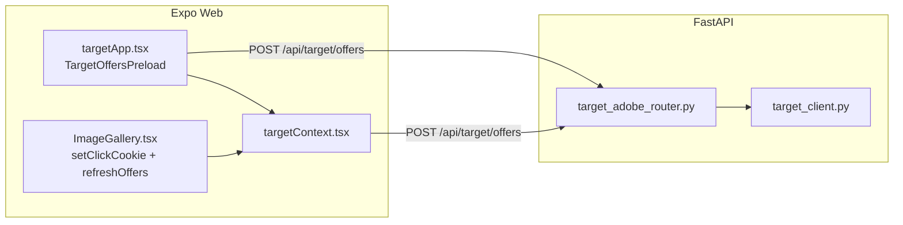

# AT_TEST_PAGE Adobe Target 연동 가이드

**문서 버전 3.0.3** (2026-05-11) — v3.0.2: 쿠키·session_id 순환. v3.0.3: 클릭·Audience 매칭은 **`params` → `parameters`만** 사용(`profileParameters` 경로 제거).

본 문서는 **현재 저장소에 적용된 Adobe Target 연동**만 설명한다.

- 제품 요약: `docs/main/01_AT_TEST_PAGE_PRD.md`
- 프론트 구조: `docs/main/02_AT_TEST_PAGE_FRONTEND_GUIDE.md`
- 백엔드·쿠폰 API: `docs/main/03_AT_TEST_PAGE_BACKEND_GUIDE.md`

---

## 0. 용어 정리 (혼동 방지)

### 0.1 Delivery API JSON vs Python SDK 타입 이름

| 구분 | 이름 | 비고 |
|------|------|------|
| HTTP(JSON) 요청 루트 | `id` | [Identifying visitors](https://experienceleague.adobe.com/ko/docs/target-dev/developer/api/delivery-api/identifying-visitors) |
| 그 안의 필드(예) | `tntId`, `thirdPartyId`, `marketingCloudVisitorId` | Adobe 문서·REST 본문의 **공식 키**(camelCase) |
| Python `delivery_api_client` 클래스 | **`VisitorId`** | OpenAPI Generator가 스키마의 `id` 객체를 매핑할 때 붙인 **클래스 식별자**. **저장소에서 임의로 바꿀 수 없다.** JSON 키가 `VisitorId`가 되는 것이 아니다. |
| `DeliveryRequest` 생성 시 (Python) | 인자 이름 **`id=`** | SDK `openapi_types`: 필드명 `id` → 타입 `VisitorId`. JSON 직렬화 시 키는 **`"id"`** (문서와 동일). |
| 우리 프록시 JSON | `tntId`, `thirdPartyId` | FastAPI `OffersRequest` / 응답 본문. 레거시로 `tnt_id`, `third_party_id` 키도 **수신**한다. |

### 0.3 “import 는 `id` 가 아니냐?” — 아니다

1. **`id`는 import 대상이 아니다.** Adobe 문서의 `id`는 **HTTP JSON 안의 키 문자열**이고, Python SDK에서는 `DeliveryRequest(..., id=visitor_id_model)` 처럼 **생성자 인자 이름**으로만 등장한다.
2. **그 인자에 넣을 값의 클래스**가 OpenAPI 제너레이터가 `VisitorId` 라고 붙인 것이다(`delivery_api_client.Model.visitor_id`). 패키지 루트에 `Id` 라는 타입을 `import` 하는 경로는 제공하지 않는다.
3. 따라서 **`from delivery_api_client import VisitorId` 가 맞다.** Adobe로 나가는 본문은 SDK가 `id`: `{ "tntId": ... }` 형으로 맞춘다.

정리: `import` 줄은 “JSON 키 이름”이 아니라 “`id` 키 **아래에 들어갈 객체의 Python 타입**”을 가져온다. 실제 전송 JSON에서는 항상 Delivery 명세의 `id` / `tntId` / `thirdPartyId`를 따른다.

### 0.2 이 저장소의 방문자 식별 정책

- **`tntId`**: 브라우저 세션 연속성. 없으면 서버가 `{uuid}.28_0` 형으로 생성하고, 응답의 정식 `tntId`를 다음 호출에 재전송한다.
- **`thirdPartyId`**: Adobe 문서상 필수는 아니나, 보낼 때는 매 호출 동일 값. 로그인 없이도 웹에서 **한 번 생성한 UUID**를 `sessionStorage`에 고정해 보내, 내부·크로스 디바이스 프로필 축을 맞춘다.

---

## 1. 문서 목적

1. 웹(Expo Web)에서 Target을 **어떻게** 호출하는지(백엔드 프록시, `fetch` 경로)를 한 번에 파악한다.
2. **설정 파일**과 **주요 소스 파일**의 역할을 매핑한다.
3. `VisitorId` 같은 SDK 고정명과 Delivery JSON 필드명을 구분한다.

---

## 2. 동작 한눈에 (offers-only)

### 2.1 흐름

1. 브라우저는 Adobe JS SDK를 쓰지 않고 **우리 FastAPI**에 `POST /api/target/offers`만 호출한다.
2. FastAPI가 **Target Python SDK** `TargetClient.get_offers`로 Adobe Delivery `POST /rest/v1/delivery`를 호출한다.
3. 갤러리 클릭 등 이후 오퍼 갱신은 **`send_notifications` 없이** `setClickCookie` + Context의 **`refreshOffers`** → 동일 엔드포인트 재호출로 처리한다(클릭 쿠키 값은 **`params` → Delivery `parameters`**).

### 2.2 적용 범위

- 오퍼 프리로드·클릭 후 재조회·오퍼 기반 UI는 **`Platform.OS === "web"`** 일 때만 동작한다.

### 2.3 구성도

### 2.4 런타임 순서(현행)

1. **앱 기동(웹)** — `_layout.tsx`가 `TargetAppProvider`·`TargetOffersPreload`(`frontend/adobe_frontend/target_frontend/app/targetApp.tsx`)를 트리에 둔다.
2. **오퍼 프리로드** — `TargetOffersPreload`가 `POST {api_url}/api/target/offers`를 한 번 호출한다. 본문: 가능 시 `page_url`, **`getAdobeTargetVisitorPayload()`** (`tntId`, `thirdPartyId` — `frontend/adobe_frontend/target_frontend/utils/targetSession.ts`), 클릭 쿠키가 있으면 `params`.
3. **백엔드** — `asyncio.to_thread` 안에서 `get_offers`. `mbox_name`이 `target-global-mbox`이면 `execute.pageLoad`, 아니면 `execute.mboxes` 한 건. `DeliveryRequest.id`에는 SDK **`VisitorId` 인스턴스**(내부적으로 `tntId`·`thirdPartyId` 직렬화).
4. **프론트 반영** — 성공 시 `sessionStorage`의 `at_tntId`·`at_thirdPartyId` 갱신, `parseAdobeTargetOffersPayload`로 Context 업데이트.
5. **클릭 후** — `ImageGallery` 등에서 쿠키 설정 후 `refreshOffers()` → 다시 `POST /api/target/offers`.

---

## 3. 기술 스택

| 영역 | 내용 |
|------|------|
| 프론트 | Expo, `fetch`, `frontend/utils/loadConfig.ts`는 **dev/prd 앱 JSON만**(별도 `config.adobe.json` 병합 없음) |
| 백엔드 | FastAPI, `target-python-sdk`, `delivery_api_client` |
| 블로킹 방지 | 동기 SDK는 **`asyncio.to_thread`** |

`backend/requirements.txt`에 `target-python-sdk` 및 전이 의존성, Python 3.13 호환 **`setuptools<70`** 명시.

---

## 4. 설정

### 4.1 Git과 비밀 값

- **`backend/env/config.adobe.json`** 은 Git 제외. 템플릿: **`backend/env/config.adobe.example.json`**.
- 클론 후 `config.adobe.example.json`을 복사해 `config.adobe.json`을 만들고 값을 채운다.

### 4.2 `backend/env/config.adobe.json`

`adobe_backend/target_backend/target_config.py`가 **`APP_ENV`와 무관하게** 이 파일만 읽는다.

| 키(평면 또는 `administration` / `mboxes` 중첩) | 설명 |
|-----------------------------------------------|------|
| `client`, `organization_id`, `property_token` | ASCII만 허용(`load_adobe_target_settings` 시점 검증) |
| `timeout` | SDK 타임아웃(ms) |
| `offer_mbox_name` | 요청에서 `mbox_name` 생략 시 기본값(없으면 `target-global-mbox`) |

### 4.3 앱 공통 `backend/env/config.{dev|prd}.json`

`api_port`, `cors_origins`, `db` 등. **Adobe 자격 증명은 넣지 않는다.**

### 4.4 CORS

`cors_origins`에 웹 앱 출처를 넣는다. `POST /api/target/offers`가 통과해야 한다.

---

## 5. 백엔드

### 5.1 엔드포인트

| 메서드·경로 | 설명 |
|-------------|------|
| `POST /api/target/offers` | 오퍼 조회만 제공(notifications/track 라우트 없음). |

### 5.2 주요 파일 (`backend/adobe_backend/target_backend/`)

| 파일 | 역할 |
|------|------|
| `target_main.py` | `register_target_routes(app)` |
| `target_adobe_router.py` | `OffersRequest`, `get_offers_endpoint`, `DeliveryRequest` 조립 |
| `target_client.py` | `TargetClient` 싱글톤 |
| `target_config.py` | `config.adobe.json` → `AdobeTargetSettings`, ASCII·빈 값 검증(`AdobeTargetConfigError`) |
| `target_delivery_utils.py` | `build_delivery_id`(`VisitorId`), 오퍼 파싱, 캐시 무효화 |
| `target_debug_utils.py` | `AT_DEBUG_DELIVERY=1` 일 때 요약·분할 로그 |

### 5.3 `app/main.py` 연결

`register_target_routes(app)`으로 `/api/target/offers`가 마운트된다. Adobe 설정은 **`get_adobe_target_settings()`** 직접 로드(`app.config` 병합 없음).

### 5.4 HTTP 오류·진단

- 설정·URL 파싱·Adobe 400 → **400**; 기타 SDK 오류 → **502** 가능.
- **`AT_DEBUG_DELIVERY=1`**: `DeliveryRequest.to_str()`·응답 `to_dict()` 분할 로그. 요약 한 줄에 `tntId`, `thirdPartyId`, `property_token` 등.

### 5.5 개발 시 주의

`delivery_api_client`의 **`ApiClient()` / `Configuration()` 을 인자 없이 만들지 않는다.** 상세는 `target_adobe_router.py` 상단 주석.

---

## 6. 프론트엔드

| 경로 | 역할 |
|------|------|
| `frontend/adobe_frontend/target_frontend/app/targetApp.tsx` | Provider + offers 프리로드 |
| `frontend/adobe_frontend/target_frontend/context/targetContext.tsx` | 오퍼 상태, `refreshOffers` |
| `frontend/adobe_frontend/target_frontend/utils/targetOffersFetch.ts` | `POST /api/target/offers`, 클릭 쿠키는 `params`, 응답 쿠키·id 저장 |
| `frontend/adobe_frontend/target_frontend/utils/targetSession.ts` | `tntId`·`thirdPartyId`·`target_cookie` 값·location hint·`session_id` |
| `frontend/adobe_frontend/target_frontend/utils/targetOfferParser.ts` | 응답 `offers` 파싱 |
| `frontend/components/ImageGallery.tsx` | 클릭 쿠키 + `refreshOffers` |

브리지 재노출이 있으면 `frontend/context/AdobeTargetContext.tsx` 등을 따른다.

---

## 7. HTTP 계약: `POST /api/target/offers`

### 7.1 요청 (JSON)

| 필드 | 필수 | 설명 |
|------|------|------|
| `mbox_name` | 아니오 | 생략 시 `config.adobe.json`의 `offer_mbox_name` |
| `page_url` | 아니오 | 글로벌 mbox·pageLoad 시 URL(가능하면 `window.location.href`) |
| `tntId` 또는 `tnt_id` | 아니오 | 이전 응답의 Target ID |
| `thirdPartyId` 또는 `third_party_id` | 아니오 | 매 호출 동일 권장(프론트는 세션 최초 1회 생성 UUID) |
| `params` | 아니오 | Delivery **`parameters`**(mbox 파라미터). Custom Audience 매칭·클릭 쿠키(`clickEvent*`)는 이 경로만 사용 |
| `target_cookie` | 아니오 | SDK `get_offers` 옵션 — **문자열**(이전 응답 `target_cookie.value`). 세션·PC ID·클러스터 힌트 포함 |
| `target_location_hint` | 아니오 | SDK 옵션 — 이전 응답 `target_location_hint_cookie.value` |
| `session_id` | 아니오 | SDK 옵션 — 동일 `tntId`/`thirdPartyId`에 대해 **30분 내 동일 값** 유지 권장(Adobe 문서) |

### 7.2 응답 (JSON)

| 필드 | 설명 |
|------|------|
| `offers` | `{ type, content }[]` |
| `mbox` | 사용한 mbox 이름 |
| `tntId` | 다음 요청에 재사용 권장 |
| `thirdPartyId` | 응답 `id` 또는 요청에서 확정된 값 |
| `target_cookie` | 있으면 `{ name, value, maxAge }` — 다음 요청 `target_cookie`에 **`value` 문자열만** 재전송 |
| `target_location_hint_cookie` | 있으면 동일 구조 — 다음 요청 `target_location_hint`에 **`value`** 재전송 |

### 7.3 SDK·문서 정합 요약

1. **쿠키 순환:** Python SDK 샘플과 같이 응답의 `target_cookie` / `target_location_hint_cookie`를 저장해 다음 `get_offers`에 넘기면 세션 연속성·엣지 라우팅에 유리하다(`target-python-sdk`: `options.target_cookie`는 **str**).
2. **`session_id`:** 옵션으로 전달 가능. 프론트는 탭 단위 UUID를 한 번 만들어 `sessionStorage`에 고정해 매 요청에 실을 수 있다.
3. **`profileParameters`:** 본 프로젝트 프록시에서는 보내지 않는다. 프로필 스크립트 기반 고급 타겟이 필요하면 이후 단계에서 추가한다.

---

## 8. 이식·점검 체크리스트

1. `backend/requirements.txt` 정합·venv에 `setuptools` 호환 버전.
2. **`backend/env/config.adobe.json`** 작성(ASCII 자격 + `offer_mbox_name`).
3. `register_target_routes`·CORS `POST` 허용.
4. 동기 SDK는 **`asyncio.to_thread`**.
5. 프론트는 **`api_url`** 로만 `POST /api/target/offers`.
6. **`tntId` + `thirdPartyId`** 및 응답 **`target_cookie` / location hint / `session_id`** 를 세션 동안 일관되게 보낸다.
7. 글로벌 mbox는 서버 **pageLoad** 경로 유지.
8. 장애 시에만 **`AT_DEBUG_DELIVERY=1`**.

---

## 9. 연관 문서

| 문서 | 용도 |
|------|------|
| `01_AT_TEST_PAGE_PRD.md` | 제품 범위 |
| `02` / `03` | 프론트·백엔드 구조(본 문서와 상호 링크) |
| `docs/log/log.md` | 변경 이력 |

---

## 10. 문서 이력

| 버전 | 일자 | 요약 |
|------|------|------|
| **3.0.3** | **2026-05-11** | `profile_params`/`profileParameters` 제거, 클릭·Audience는 `params`→`parameters`만 |
| **3.0.2** | **2026-05-11** | `get_offers` 쿠키·session_id 순환 |
| **3.0.1** | **2026-05-11** | §0.3 — JSON 키 `id` vs `import VisitorId` / `DeliveryRequest(id=...)` 구분 |
| **3.0** | **2026-05-11** | **offers-only** 반영, `tntId`/`thirdPartyId`, `VisitorId` 용어 절, notifications·프론트 adobe JSON 병합 등 구절 제거 |
| 2.9 | 2026-05-08 | (구) notification 후 offers — **현 코드와 불일치** |
| 2.8 이하 | 2026-05-07~08 | 히스토리 보관용(구 track/notifications·`visitor_id` 서술) |
